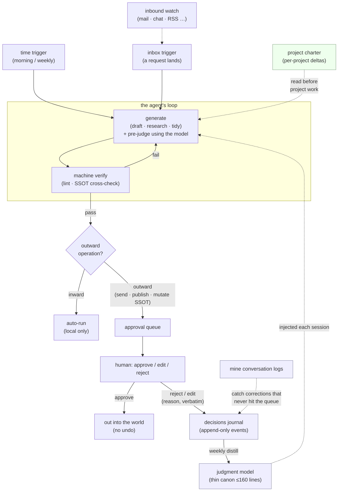

# kagemusha

<sub>🌐 **English** (canonical) · [🇯🇵 日本語版はこちら → README_ja.md](README_ja.md)</sub>

[](https://github.com/yohey-w/kagemusha/actions/workflows/ci.yml)

**Inward work runs on its own. Anything going outward stops for your approval. Even your rejections become an asset.**

---

## 1. What kagemusha is

kagemusha is **an installable kit: a set of Markdown forms plus the scripts that run them.** Not a resident agent and not a cloud service — you `git clone` it, run `./scripts/setup.sh`, and **forms with nothing filled in** land in your folder; from then on you open that folder with the AI assistant you already use (Claude Code, Codex, Cursor, …) and do your work in it.

Hand it your repetitive work — first-pass inbox handling, drafts, research, prep for recurring meetings — and every morning a "board" arrives: finished drafts and research, plus an approval queue you can clear from your phone in a few minutes.

You are the approver of record. The AI is your back office. Your rejection reasons are its curriculum.

**Why "kagemusha"?** A *kagemusha* (影武者) was a feudal lord's body double — acting in the lord's place within delegated bounds, but never signing in his name. That is this kit's mandate design, baked into the name: inward acts run on their own; outward acts wait for your seal. (Formerly `approval-loop` — the approval queue lives on as the mechanism's name inside.)

**There are two ways in, and this is the order.** ① **Just watch it** — a 10-minute demo (→ [§4](#4-watch-it-first-10-minutes)); nothing to configure, no bill, your files untouched. ② **Put it in your own setup** — a 30-minute install, copy-paste (→ [§6](#6-set-it-up-in-your-own-environment-30-minutes-copy-paste)).

> 📖 Background article (Japanese, Zenn): **[Loop engineering isn't just for engineers anymore — running it on real work, the fourth thing you have to design turned out to be "mandate" (authority)](https://zenn.dev/shio_shoppaize/articles/loop-mandate-design)**

---

## 2. Who it fits — and who it does not

**It fits you if:**

- **Operations that can't be undone** — sending, publishing, delivering, mutating a source of truth — are part of your day; you want to hand that work to an AI and you cannot afford the accident.
- You keep giving the AI **the same note over and over**, and you know the reason is thrown away each time.
- Most of what you'd hand over **isn't code**: mail, drafts, research, prep for recurring meetings.
- You want to **design and evolve your own criteria** rather than borrow someone else's frozen ones.

**It does not fit you if:**

- All you have is **a chat window with no file access** — not even the minimal setup works (full prerequisite table: [§6](#what-you-actually-need)).
- You want a shared approval **UI or SaaS** for a team: the queue here is one Markdown file and there is no dashboard ([humanlayer](#related--prior-work) is the closer fit).
- You are not willing to **write down why you rejected something** — that is the only fuel the feedback arm has, and without it the bottom half never turns.
- You need a guarantee about **how much** it helps: what's on offer is n=1, one instance (scope and limits: [`cookbook/author/evidence/README.md`](cookbook/author/evidence/README.md)).

---

## 3. What this solves (the 1-minute version)

Hand a slice of your work to an AI and two things immediately become the bottleneck — neither of them the model's raw capability:

1. **Approval.** Some operations can't be undone. A sent chat can't be unsent; a published page is public. **At work, the "send failure" costs far more than the "generation failure."** You cannot let the agent fire those on its own — but gating *everything* makes you the bottleneck.
2. **Judgment criteria.** Once approvals flow, *you* become the loop's slowest part: you keep making the same calls by hand — reject this tone, fix that number, no source no claim. That judgment is an asset, and it's being thrown away every time you click "reject."

kagemusha answers both:

- **The receiving side — the approval queue.** Split every operation in two. **Inward** (drafting, analysis, tidying, local edits) → the agent does autonomously. **Outward** (sending, publishing, mutating the source of truth) → the agent does *not* execute; it appends one entry to an **approval queue** and moves on. You clear the queue a few times a day. Autonomous speed *and* zero un-undoable mistakes.
- **The feedback side — judgment distillation.** Every rejection/correction, with its reason, gets logged and periodically distilled into a thin **value-judgment model** the agent reads each session — so it pre-judges the way you would, and fewer weak drafts ever reach the queue. Your day shifts from *doing the work* to *improving the loop.*

That's the whole thesis: **the approval queue makes it safe; judgment distillation makes it smarter over time.**

---

## 4. Watch it first (10 minutes)

One command, and the kit acts out from start to finish what it is actually for: how a piece of criticism you gave an AI — "that tone is too pushy for this client" — becomes a standing rule it follows from then on.

**What you need:** one terminal, on macOS / Linux / WSL. The only things that run inside it are `bash` and `python3`, both already on your machine. **No API key, no bill, nothing of yours touched.**

```bash
git clone https://github.com/yohey-w/kagemusha
cd kagemusha
./scripts/demo-distillation.sh
```

Then just press Enter to read your way through it (`DEMO_FAST=1 ./scripts/demo-distillation.sh` runs it with no pauses; `DEMO_KEEP=1` keeps the files the demo made so you can open them).

It plays one full turn out in front of you, on invented data. In order — and **the three screenshots below are that exact command, run for real, with nothing about the output edited**:

1. **You overrule the AI.** A few turns from a (synthetic) work session where you told the agent its draft was wrong, and why.
2. **The correction is picked up.** A free, no-model script finds those turns and files each point as one **event** — say the same thing four ways and it counts once, not four times.
3. **Nothing fires yet.** With only a handful of corrections on hand, the kit deliberately stays quiet: a model asked to draw principles out of thin material will not answer "not enough", it will produce thin principles.

   

   *While the material is thin it stays silent (SKIPPED); only on the day enough has landed does it fire (FIRED). Nothing has cost anything yet.*

4. **More lands, and it drafts a rule.** Past the threshold it proposes one rule line, with the eight things you need in order to rule on it — the exact words it came from, where it applies and where it does not, anything in the material pointing the other way, where the rule should be filed, and when to re-check it.
5. **You decide, and only you.** The proposal goes into a queue for you to read. The machine writes the diff against your instructions file and stops there: you see it, and it is **not applied**.

   

   *A proposed rule never arrives as a bare line — evidence, scope, exception, counter-evidence, where to file it and when to re-check it all come with it, and then you are asked one thing: promote, or skip.*

6. **A later check asks whether the rule did anything.** The audit walks a subsequent session and quotes the passages where the accepted rule fired — plus the one from before it existed, where it was broken.

   

   *The machine writes the diff and stops — it never applies it. The later audit puts the line where the rule fired (FIRE) next to the one from before it existed, where it was broken (BREACH).*

Everything lives in a `mktemp` sandbox that is deleted on the way out: **no model is called, none of your logs are read, and not one byte is written outside it** — pinned by test group J, which asserts the checkout is byte-identical before and after. The session logs are obviously-synthetic and the distilling model is a stub wired in at `AGENT_CMD`; every other moving part is the shipped script you will be cronning below.

**Two ways on from here.** Want it running in your own setup now → **[§6](#6-set-it-up-in-your-own-environment-30-minutes-copy-paste)**. Want the mechanism first → **[§5](#5-how-the-whole-thing-works)**.

---

## 5. How the whole thing works

One diagram, three canonical terms, one table, and the feedback arm. This section is the map; everything deeper is one link away.

### Architecture (the whole loop)



The top half is the **approval loop** (mandate): generate → verify → inward auto / outward to the queue → a human decides. The bottom half (shaded) is **judgment distillation** (the feedback arm): the human's reject/edit reasons flow into an append-only **journal**, a weekly job **distills** them into the **judgment model**, and that model is injected back so the agent pre-judges — closing the loop.

### 訂正の昇格

**Promotion of Corrections — the canonical definitions.** Three terms, fixed in this wording, because **a term is only worth anything if it means the same thing everywhere it is quoted.** Quote them freely. (日本語版: [README_ja.md](README_ja.md#訂正の昇格))

**訂正の昇格 — promotion of a correction.** *The step that takes a human's rejection or correction from a conversation with an AI, extracts a reusable criterion out of it, and raises that criterion into a standing rule through human review.*

- **Counts:** a rejection lands verbatim in the journal, comes back as a candidate rule in the promotion queue, and **you copy it into your own instructions file** — the copying is the promotion.
- **Does not count:** piling the correction into a material file or the journal. *Moving text needs no gate; promoting a correction into a rule does* ([`docs/distillation-loop.md`](docs/distillation-loop.md)) — and the gate is a person.

**人間定置網 — the human standing net.** *Keeping a human at the end of the AI, but never returning the judgment made there to the next AI run, so the human keeps performing the same check.* (A 定置網 is a fishing net fixed in place: it catches what swims by, and catches the same thing again tomorrow.)

- **Counts:** the human rules properly every single time — and the same rejection is back next week ([§3](#3-what-this-solves-the-1-minute-version)).
- **Does not count:** putting a human in front of an irreversible outward operation **as such** — that is [calibrated reliance](#calibrated-reliance--the-principle-under-the-whole-queue). A human being there is not the net; **the judgment made there not flowing back to the next run** is.

**判断ループ — the judgment loop.** The umbrella term: **the [approval loop](#3-what-this-solves-the-1-minute-version) (generate → verify → inward auto / outward to the queue → a human decides) and [judgment distillation](#rejections-become-assets--judgment-distillation) (reject reason → journal → judgment model → next session's AI) closed into a single circuit.** Not a new mechanism — the name for the state in which those two are connected.

- **Counts:** a rejection becomes a principle, and the agent that reads that principle stops producing the same draft in the first place ([evidence that the circuit closed in a live instance](cookbook/author/evidence/README.md)).
- **Does not count:** wiring where only the top half turns — the approval queue works, but reject reasons flow nowhere and the model is never revised. That is an approval loop, not a judgment loop.

**The relation folds into one sentence: to stop being a human standing net, promote your corrections and close the judgment loop.**

The file-by-file map of the whole kit is [§10](#10-reference). The mechanism in full: [`docs/judgment-distillation.md`](docs/judgment-distillation.md) · the light daily lane: [`docs/distillation-loop.md`](docs/distillation-loop.md) · what happens after promotion: [`docs/discipline-audit.md`](docs/discipline-audit.md).

### The four-layer equation

| Layer | The question | The answer at work |
|---|---|---|
| Context | What does it know? | **SSOT** (`decisions` / `tasks` / `glossary` / `people`) |
| Harness | What can it do? | CLIs, scripts, file ops |
| Loop | When does it act, how is it checked? | triggers (time / inbox) + verifiers |
| **Mandate** | **How far is it trusted; who is accountable?** | **reversible = auto / irreversible = approval queue** (proxy: inward / outward) |

The first three are "how to make it run"; only the fourth is "how far to trust it" — and out of the lab, into real work, the fourth is what actually bites. Put in workplace words, the parts are all old ideas: **trigger = the setup, verifier = the checklist, stop rule = the deadline, mandate = sign-off authority.** The agent writes the code; drawing the loop's blueprint stays with the person who knows the work best. Which file each part lands in: [`docs/design.md`](docs/design.md).

### Rejections become assets → judgment distillation

The reasons you reject or edit are the most valuable log you produce ([§3](#3-what-this-solves-the-1-minute-version)) — and there are two places to distill them into:

- **Into `verifiers.md`** — when a rejection is a *mechanical* hole (wrong weekday, missing addressee, unverified number), add one verifier and the whole class of error dies in the machine layer. You never give the same note twice.
- **Into `judgment_model.md`** — when a rejection is a *judgment* ("that tone is wrong", "price from hours not vibes"), distill it into a principle in the thin value-judgment model. The agent reads it next session and pre-judges — so that draft never reaches the queue.

Why a *correction* outranks a *ruling*: the design Q&A in [§9](#design-rationale-qa). **Proof this circuit actually closed — an unattended distillation run and the journal entries behind one principle in this repo:** [`cookbook/author/evidence/`](cookbook/author/evidence/README.md).

---

## 6. Set it up in your own environment (30 minutes, copy-paste)

### What you actually need

The mechanism is **files and discipline** — a harness-agnostic core. The prerequisites are additive: the minimal setup needs exactly one thing — a folder plus an assistant that can touch it. Each level of automation and each listening channel adds exactly one more:

| What you want to run | Prerequisites (additive) |
|---|---|
| Minimal: approval queue + SSOT + journal, run by hand | A folder of Markdown files + one AI assistant **that can read/write files in that folder** (Claude Code CLI or desktop, Codex CLI, Cursor, …). ⚠️ A plain chat window with no file access does **not** qualify — this is the most-missed hidden prerequisite. |
| Morning board / weekly distill, semi-automatic | + any nudge (a calendar reminder is enough) |
| Same, fully automatic | + a headlessly-launchable CLI + a scheduler (cron on Linux/macOS, Task Scheduler on Windows; macOS can also use the native launchd) — for one reason only: a scheduler cannot click a GUI |
| Inbound catch, Tier 1 (recommended) | + MCP connectors for your channels (Gmail / Slack / Notion) connected in your client — OAuth handled by the platform. Availability varies by plan and client. |
| Inbound catch, fully automatic (the Tier 2 script) | + channel credentials (Slack bot token / Gmail app password) — because an interactively-authenticated MCP session may be unavailable under an unattended scheduler |
| Approving from your phone | + a push channel ([ntfy](https://ntfy.sh/) or similar, free) |

**Three ways to kick off the weekly run** — all three are fine: **fully automatic** (the scheduler launches an AI *CLI* — the only mode that needs a CLI), **semi-automatic** (the scheduler just *notifies* you; you paste the weekly prompt into a desktop or web chat), or **manual** (on a fixed weekday, you simply ask your AI yourself — make it a small ritual).

In this mechanism a human has to approve principle revisions anyway (the weekly distiller *proposes*; new principles wait for your OK). So a human doing the kick-off is **not a failure of automation** — the approval and the kick-off just collapse into the same single tap.

(Those three are about *who* kicks off the same OS-scheduled run — a separate question from *which* loop mechanism to use at all. An OS scheduler, an agent's own built-in loop (e.g. Claude Code's `/loop`), and a schedule run by the coding agent's own service or app are not interchangeable — they differ in who holds the clock and whether the job can reach your local files. Comparison: [`docs/inbound-loop.md`](docs/inbound-loop.md).)

That's it. The `scripts/` in this repo are a **convenience layer** (headless automation, log mining, budget lints), not a prerequisite. Delete them and the loop still runs: the core is the Markdown files plus the discipline of *inward = auto / outward = approval queue*. A CLI + a scheduler is just the example wiring — a desktop app + a weekly calendar nudge is equally valid.

### The steps (copy-paste)

**Prerequisites** (for this scripted path only — the loop itself needs just the three things above)**:** `bash`; one AI CLI that runs a prompt non-interactively (default is the [Claude CLI](https://code.claude.com/), swappable to Codex/Gemini/etc.); optionally [ntfy.sh](https://ntfy.sh/) for phone notifications; Python 3 (only for the distillation scripts). Prefer not to script it? Skip to the semi-automatic / manual kick-off above and just paste the prompts into any assistant.

**Installing an AI CLI (if you don't have one).** Any agentic CLI works; the two most common:

- **Claude Code** (Anthropic): native installer is the recommended path — `curl -fsSL https://claude.ai/install.sh | bash` (macOS/Linux/WSL; Windows PowerShell: `irm https://claude.ai/install.ps1 | iex`), then run `claude` once to sign in ([docs](https://code.claude.com/docs/en/setup); npm install also works). Its per-directory instructions file is `CLAUDE.md` — which `setup.sh` creates for you.
- **Codex CLI** (OpenAI, GPT models): `npm install -g @openai/codex`, then run `codex` once to sign in with your ChatGPT account ([repo](https://github.com/openai/codex)). Its instructions file is `AGENTS.md` — rename the generated `CLAUDE.md` to `AGENTS.md` and you're done.

The instructions themselves (`templates/agent_instructions.md`) are tool-agnostic; `setup.sh` just saves them under the filename your tool reads.

```bash
# 1. Scaffold (5 min) — clone, then scaffold INTO the clone and live in it.
#    The allowlist .gitignore means your SSOT / journal / config can never be
#    committed, and `git pull` updates the kit without touching your data.
#    Never clobbers existing files. (Prefer a separate dir? ./scripts/setup.sh ~/work-loop)
git clone https://github.com/yohey-w/kagemusha.git
cd kagemusha
./scripts/setup.sh

# 2. Fill the source of truth (15 min) — the one part a machine can't do.
#    Edit ssot/{decisions,tasks,glossary,people}.md — a few real entries each.
#    (tasks.md: always include a "source" column so nothing is "he-said / she-said".)

# 3. Wire the time trigger (5 min).
cp config.env.example config.env      # git-ignored; holds your paths + notify topic
$EDITOR config.env                    # set PROJECT_ROOT / AGENT_CMD / NTFY_TOPIC
./scripts/morning_brief.sh            # run once by hand (read-only, ~a few minutes)

# 4. Put it on cron (or Windows Task Scheduler → docs/windows.md, or a daily
#    calendar reminder to run it by hand — any OS scheduler is equivalent;
#    other loop mechanisms are not, see docs/inbound-loop.md).
#    53 6 * * *  /path/to/kagemusha/scripts/morning_brief.sh
```

**Then, once the loop is running, turn on the feedback side (optional):**

```bash
# 5. Seed a few of your own principles in judgment/judgment_model.md
# 6. Copy the weekly distiller and edit its CONFIG block:
cp scripts/weekly_distill.sh.example scripts/weekly_distill.sh && $EDITOR scripts/weekly_distill.sh
# 7. Cron it weekly (proposes changes; new principles wait for your OK):
#    17 21 * * 0  /path/to/kagemusha/scripts/weekly_distill.sh
```

See [`docs/judgment-distillation.md`](docs/judgment-distillation.md) for how it works.

**Or start with the light lane: harvest daily, distill only when there is material.**

```bash
# 5'. Cut templates/correction_patterns.example.txt down to phrases YOU use, then:
#     7  6 * * *  scripts/correction_scan.py --patterns … --material … --state … --since 1d --dir …
#                 (--dir is NOT optional under cron: without it the log path is guessed
#                  from the working directory, which cron sets to $HOME. setup.sh prints yours.)
#    23 6 * * *  scripts/distill.sh     # fires only past the threshold; silent otherwise
```

`correction_scan.py` costs nothing (no LLM) and groups the day's corrections into **events** — four rephrasings of one point are one event, never four witnesses. `distill.sh` runs daily and almost always does nothing: a model asked to distill principles from two thin corrections will not say "not enough", it will produce two thin principles, so the threshold is what keeps the output honest. What it produces is a **promotion queue** for you to read — never an edit to your rules file. [`docs/distillation-loop.md`](docs/distillation-loop.md).

### Optional: a verifier from a different model lineage

This kit is built around the assumption that AI output can be wrong — that's the whole reason the approval queue and the verifiers exist. But there's a blind spot: if the model that checks the work shares a lineage with the model that did the work, a failure mode common to that lineage slips past both. (Research on inference-time scaling reports a pattern — getting pulled off track by irrelevant context the longer a model reasons — that shows up across a model *family*, not just one model: [Inverse Scaling in Test-Time Compute](https://arxiv.org/abs/2507.14417).) So it's worth wiring in one checker from a different vendor.

- **What:** the [Codex plugin for Claude Code](https://github.com/openai/codex-plugin-cc) — an official plugin that calls OpenAI's Codex CLI from inside Claude Code — plus the Codex CLI itself and an OpenAI-side login. Its usage quota is billed separately from Claude usage, so reaching for it doesn't eat into your main work's budget.
- **When to reach for it:** (1) a second diagnosis when you're stuck, (2) designing a fix for your *own* blind spot — don't ask the side that has the blind spot to design around it, (3) an independent check before a big publish or delivery. Having it review this kit's own verifiers, or a distilled change to the judgment model, is the typical case.
- **How to install** (verified against the plugin's own README):

  ```bash
  # inside Claude Code
  /plugin marketplace add openai/codex-plugin-cc
  /plugin install codex@openai-codex
  /reload-plugins
  /codex:setup   # checks whether Codex is ready; can install/log you in if not
  ```

  Requires a ChatGPT subscription (Free tier included) or an OpenAI API key, and Node.js 18.18+. Full requirements and usage: the plugin's own [README](https://github.com/openai/codex-plugin-cc).

---

## 7. Your day, once it is running

> **A morning with the loop.** Overnight, notifications stay silent — **but the inbound watch never stops.** At 06:53 your phone buzzes ([ntfy](https://ntfy.sh/)): today's board — 3 drafts and 1 research memo the loop finished yesterday, 2 requests that landed overnight, 2 items waiting in the approval queue.
> Coffee in hand, you answer from your phone: YES, YES, NO — "too pushy for this client." Two minutes.
> That NO, verbatim, is appended to the decisions journal.
> On Sunday night the weekly distiller turns it into a principle in the judgment model.
> The agent reads that model every session — the same rejection never comes back.

That is the shape. Here is the actual handling, and the file each step happens in.

**Morning.**

1. **Open the approval queue** — the unprocessed section of `approval_queue.md`. Every card already carries what you need in order to rule *without* re-reading the deliverable: the artifact itself (never a summary), whether the act can be undone, the agent's declared doubt, its one recommendation, and what it will do if you say nothing. The mark in the heading is the weight — 🔴 nothing moves until you rule, 🟡 taste, so no answer means it proceeds on the recommendation — and a batch is at most three cards. Tick approve / edit-and-approve / reject. → [`templates/approval_queue.md`](templates/approval_queue.md), [`docs/decision-cards.md`](docs/decision-cards.md)
2. **Read the one-page board** — `briefs/<date>.md`, written by the time trigger before you woke up: what happened overnight, today's deadlines and promises, what is waiting on you (each with one recommended line), work in progress, and — stated plainly — whatever that unattended run could *not* read. → [`scripts/morning_brief.sh`](scripts/morning_brief.sh)

**Whenever you reject — this is the entire fuel supply for the bottom half.**

3. **Write the reason on the card**, in your own words, in the reject line's reason slot. Then the settled card moves to the processed section and the reason is copied **verbatim** into the judgment journal — that verbatim quote is the only thing a principle may later be built from. → [`templates/approval_queue.md`](templates/approval_queue.md), [`templates/decisions_journal.md`](templates/decisions_journal.md)
4. **If the rejection was a mechanical hole, add one verifier** to `verifiers.md`. One line, and it applies to every future output. → [`templates/verifiers.md`](templates/verifiers.md)

**Once a week.**

5. **Rule on the promotion candidates** (about five minutes) — read `promotion_queue.md` and copy **only the ones you accept** into your own instructions file. The copying *is* the promotion — the distillation lane may write this queue and nothing else: not your instructions file, not the principles, not the source of truth. → [`templates/promotion_queue.md`](templates/promotion_queue.md), [`docs/distillation-loop.md`](docs/distillation-loop.md)
6. **Read the discipline audit** — the week's scan quotes the passages where each discipline you adopted fired or was broken, and the prompt turns them into a finding of thirty lines or less. It quotes; it does not judge. A dead-letter candidate is an invitation to look, not a proposal to delete. → [`scripts/discipline_scan.py`](scripts/discipline_scan.py), [`docs/discipline-audit.md`](docs/discipline-audit.md)

---

## 8. Safety and data boundaries

First, what this kit **does not** do to your data.

### What `setup.sh` expands, and what it deliberately does not

This repository is **two layers**, and the line between them is the answer to "what did I just install?"

| | **Core** — `scripts/` `templates/` `docs/` `tests/` `manifests/` (the repository root) | **[`cookbook/`](cookbook/README.md)** — the sample shelf |
|---|---|---|
| What it is | the **mechanism**: scaffolding, scripts, **empty forms**, the acceptance gate | **content**: disciplines the author burned in a live loop, evidence excerpts, other people's shelves |
| `setup.sh` | **touches only this.** Every file it copies is listed in [`manifests/scaffold.tsv`](manifests/scaffold.tsv) | **never read, never copied, never executed** — not one file |
| What you get | forms with nothing filled in: zero principles, zero active patterns, zero dated entries | nothing, until **you read it, pick a line, and move it by hand** |

**Core holds no opinion about which judgments you should adopt.** A borrowed principle eats the same budget as one you burned yourself, so the shelf is not a default and copying from it is a manual act on purpose — that act is where you choose. Boundary in full: [`docs/layers.md`](docs/layers.md). What the shelf's stamps do and don't mean: [`cookbook/README.md`](cookbook/README.md).

⚠️ The split is **not a privacy boundary**: `cookbook/` and core are the same repository and the same permanent history.

<details>
<summary><b>core-only checkout</b> — don't want other people's content in your working tree at all?</summary>

Because core never reads the shelf, you can simply not check it out. Verified end to end (clone → `ls` → `setup.sh` exits 0):

```bash
git clone --filter=blob:none --no-checkout https://github.com/yohey-w/kagemusha.git
cd kagemusha
git sparse-checkout set --no-cone '/*' '!/cookbook'
git checkout
./scripts/setup.sh          # runs exactly as it does with the shelf present
```

`--filter=blob:none` only saves bandwidth (it is ignored by some transports, harmlessly); the pattern pair is what leaves `cookbook/` out. Get it back any time with `git sparse-checkout disable`.

**What this does not buy — read this before you rely on it.** It is a **checkout-size convenience, and nothing else.** The shelf is still in the remote, still in this clone's object database, and still in the history: `git log`, `git show`, and any later `git checkout` reach it. It grants no privacy, no isolation, and no guarantee about content — the same disclaimer as [`docs/layers.md`](docs/layers.md) and [`cookbook/README.md`](cookbook/README.md). **Do not call it a privacy mode.** The kit's own acceptance gate measures the underlying property directly: test group H deletes `cookbook/` outright and proves `setup.sh` still exits 0 and creates exactly the same set of files.

</details>

**What keeps the data you create out of git** is the allowlist `.gitignore`: only the kit's own files are tracked, so your SSOT, journal, and config cannot be committed even by accident — and `git pull` updates the kit underneath them. Which paths are the kit's and which are yours is drawn file by file in [§9](#9-going-further).

---

## 9. Going further

From here on, read only what you turn out to need.

### Catching the world's input — the three loops

The diagram in §5 has two triggers. The **time trigger** (T1) ships as `morning_brief.sh` / `weekly_distill.sh.example`. The **inbox trigger** (T2) is a loop of its own — an **inbound watch** that polls the channels where work lands on you (mail, chat, SNS mentions, blog reactions), classifies each new item with a closed enum, holds the night's noise for one morning roll-up, and appends every detection to an immutable ledger so nothing dies silently. Connect your Gmail / Slack via your assistant's connectors and run the sweep procedure ([`templates/inbound_sweep.md`](templates/inbound_sweep.md)) — the script ([`scripts/inbound_watch.sh.example`](scripts/inbound_watch.sh.example)) is only for unattended scheduler runs. Three loops, one system: **inbound catch** (the world → you) → **work loop** (generate → verify → queue) → **judgment feedback** (your rejections → the model). Design + setup: [`docs/inbound-loop.md`](docs/inbound-loop.md).

### Running multiple projects — charters, the system map, and living in the clone

Run the loop on more than one client or project and two structures earn their keep (both scaffolded by `setup.sh`):

- **One charter per project — but the personality stays singular.** Should the judgment model be split per project? No. Corrections are the loop's most valuable signal (§5); split the model per project and that signal scatters into thin, separate streams. What differs per project is not the principles but *how they apply*. So the judgment model stays one file, and each project gets a **charter** (`projects/<name>/charter.md`, ≤60 lines) holding only the *deltas*: the counterpart's decision style, the delegation boundary for this project, pricing discipline, communication register, and which principles bite harder or take exceptions here. Never copy a principle's text into a charter — the same proposition in two places means a correction reaches only one, and the other rots. The agent reads the charter before any work on that project.
- **A one-screen system map** (`system_map.md`, at the instance root — the hottest file gets the shortest path): standing mechanisms (what runs, why, how to stop it), one card per project (status / our next move / waiting on them / deadline), and a one-line roadmap. Status lives in the map, never in charters — **charters carry judgment deltas, the map carries state.**

And you run all of it **directly inside the clone**. The allowlist `.gitignore` tracks only the kit (marked ✓ below); everything you create is untrackable by construction, and `git pull` upgrades the kit under your data. This kills the classic failure of copying a kit out into a separate dir and drifting from upstream:

```text
kagemusha/                     ← your clone = your instance
├── README.md  docs/  scripts/  templates/  tests/  manifests/     ✓ tracked (core)
├── cookbook/                    ✓ tracked (the sample shelf — never scaffolded)
│   ├── author/                  the author's burned disciplines + evidence excerpts
│   └── community/               one directory per contributor, format-lint only
├── CLAUDE.md (or AGENTS.md)      agent instructions — the instance constitution
├── system_map.md                 the one-screen board
├── approval_queue.md             the queue outward operations pile into
├── verifiers.md                  standing verifiers
├── ssot/                         current truth (overwritten in place)
├── judgment/                     append-only past (journal + judgment model)
├── projects/
│   ├── <name>/charter.md         per-project deltas (one folder per map card)
│   └── _archive/                 retired projects (mv, don't delete)
├── briefs/  logs/  local/        daily boards · run logs · machine-local scripts & secrets
```

Five invariants drive this layout: **card = folder = charter (1:1:1)** — one map card ↔ one `projects/<name>/` ↔ one `charter.md` inside it, so drift is lintable; **state vs history** — `ssot/` is overwritten truth, the journal is append-only past; **the personality is singular** — `judgment/` never splits per project; **the hottest file gets the shortest path** — the map sits at the root; **archive = one folder move** — retiring a project is `mv projects/<name> projects/_archive/`, and its charter travels with it. Rationale in [`docs/design.md`](docs/design.md).

### Calibrated reliance — the principle under the whole queue

Why gate outward operations at all? Because of one quiet failure mode: **the fact that an AI produced something is not evidence that it's correct.** Fluency and a confident tone are not proof. The approval queue is only the operational form of a deeper rule this kit adopts (arrived at through outside audit of the design):

> **Short form.** The fact that an AI produced it is not evidence that it's right. Before you use an output as an answer, put it through verification proportional to its use.

The full form spells out *how much* verification:

> Don't treat an LLM's output as correct on the strength of fluency or a decisive tone alone. For each output, set the level of checking by the loss if it's wrong, its reversibility, how detectable an error would be, and the cost of checking — then verify with independent sources, deterministic tests, experiments, a separate line of evaluation, or expert human judgment. For low-risk, reversible uses, a sample audit or after-the-fact monitoring can be enough; for high-risk or irreversible uses, require independent verification *before* execution. The goal is not to distrust AI at all times, but to design the *right* reliance — adopt the correct outputs, reject the wrong ones.

This is exactly why the split of [§3](#3-what-this-solves-the-1-minute-version) falls where it does: inward operations are reversible and low-loss, so a sample audit after the fact is enough; outward operations are often irreversible and high-loss, so they get independent verification *before* they fire. The queue is calibrated reliance applied to the one axis that bites hardest at work — whether an action can be undone.

**Which means inward/outward is a proxy, not the axis itself.** In practice it misfires in exactly two places: **reversible-outward** (a push that leaves history and can be reverted — gating each one buys no safety and makes you the bottleneck) and **irreversible-inward** (a local-only data operation with no way back). Use the proxy where it's convenient; in those two places, re-decide on the real axis — **can this be undone?** (See [`docs/design.md`](docs/design.md) and P1 of [`templates/judgment_model.md`](templates/judgment_model.md).)

### Count your work — where does your time actually go? (G/S/D/V/I/R)

The loop's promise is that your day shifts *from doing the work to improving the loop* (§3). That's a claim about **where your time goes** — so make it measurable. Tag each slice of your own effort with one of six letters:

| Tag | Kind of work | What it means |
|---|---|---|
| **G** | Generate | You produce the first substantive draft or candidate. |
| **S** | Specify | You set the goal, the question, the constraints, the context. |
| **D** | Dispose | You accept, reject, partially select, or order a fix. |
| **V** | Verify | You test, fact-check, run an experiment, measure the result. |
| **I** | Integrate | You wire it into a system or the real workplace. |
| **R** | Relate | You persuade, negotiate, reach agreement, share accountability. |

The bet behind the approval loop is that, on repetitive work where candidates are cheap to generate and outputs are cheap to evaluate, the share of **G** falls and the share of **D + V** rises — you spend less time *making the first draft* and more time *disposing of and verifying* the agent's. This codebook lets you check that against your own logs instead of taking it on faith.

One rule keeps the count honest: **S, V, I, and R do not count as D (disposal / judgment).** Specifying, verifying, integrating, and relating are each their own work; folding them into "judgment" inflates the disposal bucket and blurs where your time really went.

### Design rationale (Q&A)

**Q. Why are rejections/corrections the "highest-value log"?**
Because a ruling is predictable and a correction is not. Models get better at guessing which option you'll pick; they do not get better, on their own, at the exact places where *your* judgment diverges from theirs — that's what a correction marks. Mine your own logs and corrections outnumber clean rulings, yet the queue discards them the instant you click reject. Distillation captures that delta before it evaporates.

**Q. Why build principles only from things the approver actually said?**
The classic failure is promoting *your guess about the approver's reasoning* into a principle — it then silently biases every later call, and no one notices. So a principle is promoted only if a **verbatim quote** can be cited from the journal. Inferences stay tagged `[working hypothesis]` in the journal until the approver confirms them. Real utterances only; guesses stay quarantined.

**Q. Why cap the judgment model at ~160 lines / ~32 principles?**
Adherence, not aesthetics. Long instruction files stop being followed — the head is read, the tail ignored, and auto-bloated instructions can *lower* accuracy. So the one file injected every session is kept deliberately thin, and a machine lint enforces the budget. Want to add a principle past the cap? Merge or retire an old one first. **The cap is a cost, not a moat — the thinness is the point.** (Both limits are configurable in `weekly_distill.sh`.)

**Q. How is this different from HITL (human-in-the-loop)?**
HITL is the *mechanism* ("put a human in the loop"); this kit is the *design* — *where* to insert the human, *what* to make the agent declare (basis, undo-ability, doubt), *how* to turn rejections into assets, and *how* to widen trust over time. Having a stop button and designing when to stop are different things.

---

## 10. Reference

### What's in the box

| Path | Role |
|---|---|
| **`templates/decisions.md`** | SSOT — what's decided (and what's been superseded). Append-only, event-sourced. |
| **`templates/tasks.md`** | SSOT — who owes what, by when, and where it came from. |
| **`templates/glossary.md`** / **`people.md`** | SSOT — canonical terms and named people (for wording lints & addressee checks). |
| **`templates/approval_queue.md`** | The queue outward operations pile into. Has a **"doubt" field** so review takes seconds. |
| **`templates/verifiers.md`** | Standing verifiers — a machine layer of lints + deliverable-type Definitions of Done. |
| **`templates/decisions_journal.md`** | **Judgment journal (L2)** — append-only log of rulings/corrections/rejections, with verbatim quotes. |
| **`templates/judgment_model.md`** | **Value-judgment model (L1)** — the thin canon (≤160 lines) the agent reads each session. |
| **`templates/system_map.md`** | **System map** — the one-screen board (standing mechanisms + one card per project + roadmap). Scaffolds to the instance root. |
| **`templates/charter.md`** | **Project charter** — per-project *deltas* only (≤60 lines); the judgment model itself never splits. Copy into `projects/<name>/charter.md`. |
| **`templates/agent_instructions.md`** | **The instance constitution** — saved as `CLAUDE.md` (Claude Code) / `AGENTS.md` (Codex) / your tool's rules file. |
| **[`cookbook/author/starter-disciplines.md`](cookbook/author/starter-disciplines.md)** | **Starter disciplines** — on the **sample shelf**, a *menu, not a template* (deliberately **not** scaffolded by `setup.sh`): disciplines burned in the author's live instance, each with the burn it came from, a portability label, and a paste target. Take only the ones whose hole you've already fallen into. |
| **`templates/discipline_catalog.example.yaml`** / **`templates/discipline-audit-prompt.md`** | The audit's two halves: the catalog of disciplines you want watched (with the regex that catches each one), and the weekly prompt that turns candidates into a ≤30-line finding. |
| **`templates/inbound_sweep.md`** | **Inbound sweep procedure (Tier 1)** — the inbox trigger run through your assistant's MCP connectors: lanes, closed-enum triage, append-only ledger, quiet hours. |
| `.gitignore` | Allowlist — only the kit is tracked, so your instance data can never be committed. |
| `scripts/setup.sh` | Scaffold all of the above into the clone itself (default) or a target dir (safe to re-run). |
| `scripts/morning_brief.sh` | The time trigger — an inward-only, read-only morning stock-take. |
| **`scripts/mine_conversations.py`** | Extract the approver's own turns from AI-CLI logs (rulings/corrections). |
| **`scripts/filter_judgments.py`** | Bucket those turns into RULE/REJECT/CORRECT/… (vocab configurable, EN+JP defaults). |
| **`scripts/discipline_scan.py`** | **Is a discipline you adopted doing anything?** Walks your own session logs and quotes the passages where each one fired or broke. It matches and quotes; **it does not judge**. See [`docs/discipline-audit.md`](docs/discipline-audit.md). |
| **`scripts/weekly_distill.sh.example`** | The weekly feedback trigger — mine → journal → distill into the model (proposes; you confirm). |
| **`scripts/correction_scan.py`** | The daily harvest, no LLM: yesterday's corrections, grouped into **events**, appended to a local material file plus a provenance index (full session id, line number, sha256) so `--show-event` can reopen any quote in its original context. Your correction vocabulary is not shipped — you supply `--patterns` (menu: `templates/correction_patterns.example.txt`). |
| **`scripts/distill.sh`** | The **material** trigger — fires only when enough corrections have piled up (the time-based fallback is OFF by default — a slow week gets named in the skip line, not distilled), freezes a **batch manifest** before it calls anything, invokes the model **without file permissions** (the report comes back on stdout), validates that report against the manifest, appends it to the promotion queue itself, and keeps FIRED / SKIPPED / **FAILED** apart. [`docs/distillation-loop.md`](docs/distillation-loop.md). |
| **`templates/distill-prompt.md`** / **`templates/promotion_queue.md`** | The distillation prompt (one rule line plus eight fields per candidate; conflicts with your existing principles are *held*, not resolved) and the queue you empty by hand — the promotion step that stays a person. |
| **`scripts/inbound_watch.sh.example`** | The inbox trigger, Tier 2 — inward-only inbound watch for unattended scheduler runs (Slack / Gmail-IMAP / RSS lanes; immutable ledger; quiet-hours roll-up). |
| `scripts/test.sh` | The kit's own acceptance gate — run `./scripts/test.sh` (needs `shellcheck`); CI runs this exact command. It really executes `setup.sh` in a throwaway clone, proves the allowlist `.gitignore` makes instance data uncommittable, and drives `morning_brief.sh` with a fake CLI. No skips: a missing tool is a failure. |
| `docs/design.md` | Implementation guide: the four parts + mandate, mapped to files. |
| **`docs/judgment-distillation.md`** | The feedback side in full: 4 layers, 8 triggers, event sourcing, the weekly 7-step, three-layer change governance. |
| **`docs/inbound-loop.md`** | The inbound-watch loop: lanes & cadences, quiet hours, the immutable ledger, injection defense, the batch-level baseline lesson, Tier 1 / Tier 2. |
| `docs/fixed-point-sweep.md` | Fixed-point sweep — the diff-shaped watcher pattern: a baseline of the known, the three states NEW / NOCHANGE / FAILED kept apart, an append-only baseline advanced on success only, and why a silent run still has to be logged. |
| **`docs/decision-cards.md`** | Decision cards — cognitive design of the approval hand-off: the artifact itself, one recommendation, a no-answer default, severity marks, ≤3 per batch. |
| **`docs/distillation-loop.md`** | The distillation courier — harvest daily for free, fire on **material** rather than the clock, and why the run may write only a promotion queue: moving text needs no gate, promoting a correction into a rule does. |
| **`docs/discipline-audit.md`** | Discipline audit — what it proves is **not** that a discipline works, but that the mechanism detecting breaches is running. **Trace** vs **prohibition** (compliance with a prohibition is unobservable), why an auditable discipline must be written as a trace, and the weekly three steps. |
| **`docs/provenance.md`** | Provenance table — which idea entered the kit, in which file, in which commit, and what set it off. Every trigger cell carries a tag saying how strongly it is sourced. |
| `docs/windows.md` / `docs/faq.md` | Task Scheduler alternative; FAQ. |
| **[`cookbook/author/evidence/`](cookbook/author/evidence/README.md)** | **Proof the loop actually runs** — on the **sample shelf**: hand-redacted excerpts from the author's live instance, one unattended weekly-distillation run, and the two dated journal entries that bracket a correction ending up as a rewritten principle in the judgment model. Scope and limits stated in [`cookbook/author/evidence/README.md`](cookbook/author/evidence/README.md). |

### FAQ (behavior & usage)

**Q. Does the weekly distillation rewrite my judgment model unattended?**
No — it proposes. Reinforcing an existing principle (adding a citation) is applied directly; a **new** principle or a **contradiction** is written to a `*_pending.md` file for you to confirm. An unattended rewrite of the model that governs the agent's calls is exactly the kind of un-undoable change this whole kit exists to gate.

**Q. Can I use a CLI other than Claude?**
Yes. Swap `AGENT_CMD` / `AGENT_MODEL` / `AGENT_FLAGS` in `config.env` and edit the one invocation line at the "CLI-SWAP POINT" comment in the scripts. Any CLI that takes a prompt on argv and runs non-interactively works (Codex, Gemini, …). Prompts and SSOT formats are model-agnostic.

More in [`docs/faq.md`](docs/faq.md).

### Adding to the kit — where a contribution goes

Two inflows keep this repository from freezing: the author's live instance, and your reports of what did not transfer. Why growth is structural rather than a promise, and what a contribution is measured against: [`.github/CONTRIBUTING.md`](.github/CONTRIBUTING.md).

**Three places, two kinds of review.**

- **The kit itself and the curated discipline set** ([`cookbook/author/starter-disciplines.md`](cookbook/author/starter-disciplines.md), docs, formats) — **a maintainer rules on it**, against the four axes that file's own `## 増やし方` states: burned from a real rejection, the proposition survives having the profession stripped off, "delete this line — does the agent then get it wrong?", and the entry metadata (portability label / paste target / burn origin). No automation merges here.
- **Your own shelf** — [`cookbook/community/<your GitHub login>/`](cookbook/community/README.md), for what the curated gate throws away on purpose: disciplines specific to your environment, and disciplines belonging to your profession. A PR touching only your directory and passing a mechanical format lint is **auto-approved and squash-merged with nobody reading it** — which is exactly why [`cookbook/community/README.md`](cookbook/community/README.md) is about where the responsibility sits, and why it stays in the git history whatever you delete later.

### Related & prior work

This layer already has good pioneers; this kit owes them a lot.

- **[humanlayer](https://github.com/humanlayer/humanlayer)** — the standout approval layer that interposes human approval on an agent's high-risk operations, as an SDK, over Slack/email.
- **[CoWork OS](https://github.com/CoWork-OS/CoWork-OS)** / **[AgentOS (Agno)](https://github.com/agno-agi/agno)** — OS layers for work agents with approval gates and execution visibility.
- **[ACE (Agentic Context Engineering)](https://arxiv.org/abs/2510.04618)** — research on incrementally updating a playbook from execution traces (Generator / Reflector / Curator).
- **[ZOZO's weekly rules-update practice](https://zenn.dev/zozotech/articles/20260423_pr_review_claude_rules)** — collecting and distilling PR-review comments weekly into agent rules (humans review adoption). The same loop as our "distilling rejections," run in the code-review world.

This kit's one differentiator: **it treats the human's judgment log (the queue's reject/edit reasons) as a first-class input, and runs non-code work on plain markdown alone.**

### Genealogy (same author, prior work)

- **[multi-agent-shogun](https://github.com/yohey-w/multi-agent-shogun)** — parallel orchestration; topology design across many agents.
- **[CoDD (codd-dev)](https://github.com/yohey-w/codd-dev)** — deliverable verification ("consistency-driven development"); the "prevent false success" idea. This kit's verifiers are its work-world version.

Third in the series: orchestration (who acts) → verification (is it right) → **mandate (how far to trust)**.

### License

MIT. See [LICENSE](LICENSE).
