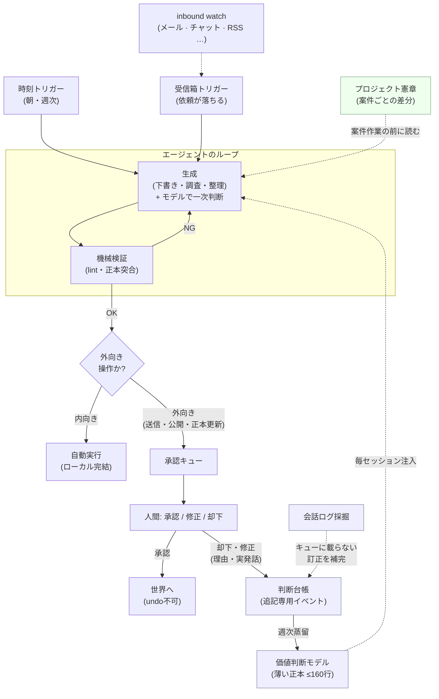

# kagemusha

<sub>🇯🇵 **日本語** · [🌐 English version (canonical) → README.md](README.md)</sub>

[](https://github.com/yohey-w/kagemusha/actions/workflows/ci.yml)

**内向きの仕事は、勝手に進む。外へ出るものは、あなたの承認で必ず止まる。却下した理由まで、資産になる。**

繰り返しの仕事（受信箱の一次対応・下書き・調査・定例の準備）を渡すと、毎朝「盤面」が届きます——できあがった下書きと調査、そしてスマホで数分で捌ける承認キュー。

あなた＝決裁者。AI＝実務担当。却下の理由＝教材。

**なぜ「影武者」か。** 影武者は主君の代わりに、委ねられた範囲でだけ振る舞う分身——しかし、主君の名でサインすることだけは決してしない。このキットの権限設計（内向き＝自動／外向き＝あなたの印）は、名前に最初から入っている。（旧名 `approval-loop`——承認キューは中の機構名として残る。）

> **ループのある朝。** 夜のあいだ、通知は黙っている。**だが受信箱の見張りは止まらない。** 06:53、スマホが鳴る（[ntfy](https://ntfy.sh/)）: 今日の盤面——昨日ループが仕上げた下書き3本と調査メモ1本、夜のうちに落ちてきた依頼2件、承認キューに2件。
> コーヒー片手にスマホから答える: YES、YES、NO——「この相手にこのトーンは押しつけがましい」。2分。
> その NO は、実発話のまま判断台帳へ追記される。
> 日曜の夜、週次蒸留がそれを価値判断モデルの原則に変える。
> エージェントは毎セッションそのモデルを読む——同じ却下は二度と来ない。

まずはコピペ1回で:

```bash
git clone https://github.com/yohey-w/kagemusha && cd kagemusha && ./scripts/setup.sh
```

あとはそのフォルダを AI アシスタント（Claude Code / Codex / 何でも）で開くだけ——詳細は[クイックスタート](#3-クイックスタート30分コピペで動く)。

> 📖 背景記事（Zenn）: **[ループエンジニアリングはもうエンジニアだけのものじゃない、業務で回して見つけた4つ目の設計対象は「権限」だった](https://zenn.dev/shio_shoppaize/articles/loop-mandate-design)**

---

## 1. これは何を解くのか（1分版）

自分の仕事の一部を AI に渡すと、律速になるのは即座に2つ——どちらもモデルの素の能力ではない:

1. **承認。** 取り消せない操作がある。送ったチャットは取り消せず、公開したページは公開されたままだ。**業務では「送信の失敗」が「生成の失敗」より桁違いに高くつく。** これをエージェントの一存で撃たせるわけにはいかない——だが**全部**をゲートすると、今度は自分がボトルネックになる。
2. **判断基準。** 承認が回り始めると、今度は**あなた**がループの最も遅い部分になる。同じ判断を手で下し続ける——このトーンは却下・その数字を直せ・出典が無いなら書くな。その判断は資産なのに、「却下」を押すたびに捨てられている。

kagemusha は両方に答える:

- **受け皿——承認キュー。** 全操作を2種類に分ける。**内向き**（下書き・分析・整理・ローカル編集）→ エージェントの一存で全自動。**外向き**（送信・公開・正本の書き換え）→ 実行せず、**承認キュー**に1件積んで次へ移る。人間は1日に数回キューを捌く。**「自律の速度」と「取り消せない事故ゼロ」が両立する。**
- **フィードバック側——判断蒸留。** 却下・訂正を理由ごと記録し、定期的に薄い**価値判断モデル**へ蒸留する。エージェントは毎セッションこれを読み、**あなたの代わりに一次判断**する——だから筋の悪い案がそもそもキューに届かなくなる。日々の仕事が「作業」から「ループの改善」に変わる。

これがこのキットの主張だ: **承認キューが安全にし、判断蒸留が時間とともに賢くする。**

---

## 必要なのはこれだけ（What you actually need）

この機構の本体は**ファイルと規律**——ツール非依存（harness-agnostic）だ。前提条件は積み木式で、最小構成に要るのは実質1つ——フォルダと、それに触れるアシスタント。自動化を1段上げるごと・聴くチャンネルを1本足すごとに、前提が1つずつ増えるだけだ:

| 何を動かしたいか | 前提条件（積み木式・上に足すだけ） |
|---|---|
| 最小構成: 承認キュー＋SSOT＋台帳を手動で回す | Markdown のフォルダ ＋ **そのフォルダのファイルを読み書きできる** AI アシスタント1つ（Claude Code の CLI/デスクトップ・Codex CLI・Cursor 等）。⚠️ ファイルに触れないただのチャット画面は**不可**——ここが一番見落とされる隠れ前提。 |
| 朝の盤面・週次蒸留を半自動で | ＋ 何かしらの合図（カレンダーのリマインダーで十分） |
| 同じものを全自動で | ＋ ヘッドレス起動できる CLI ＋ スケジューラ（Linux/macOS なら cron、Windows ならタスクスケジューラ。macOS 純正の launchd でも可）——理由はただ1つ、スケジューラは GUI をクリックできないから |
| 受信箱キャッチ Tier 1（推奨） | ＋ 使うチャンネル（Gmail / Slack / Notion）の MCP コネクタをクライアントに接続——OAuth はプラットフォーム持ち。利用可否はプランとクライアントによる。 |
| 受信箱キャッチを全自動で（Tier 2 スクリプト） | ＋ チャンネルの認証情報（Slack Bot トークン / Gmail アプリパスワード）——無人スケジューラ実行では対話認証済み MCP セッションが使えないことがあるため |
| スマホから承認 | ＋ push 通知チャンネル（[ntfy](https://ntfy.sh/) 等・無料） |

**週次の着火（kick-off）の3段階**——どれでもよい: **全自動**（スケジューラが AI の *CLI* を定時起動——CLI が要るのはこのモードだけ）、**半自動**（スケジューラは*通知だけ*。人間がデスクトップ／Web のチャットに週次プロンプトを貼る）、**手動**（決まった曜日に、自分で AI に頼む——小さな儀式にしてしまえばいい）。

この機構では、原則の改訂にどのみち人間の承認が要る（週次蒸留は*提案*止まりで、新規原則はあなたの OK を待つ）。だから着火を人間がやることは**自動化の失敗ではない**——承認と着火が同じワンタップに畳まれるだけだ。

（この3段階は「同じOSスケジューラ駆動の実行を誰が着火するか」の話で、「そもそもループをどこで回すか」とは別の問いだ。OSのスケジューラ・動いているセッション自身に繰り返させる方法（例: Claude Code の `/loop`）・AIコーディングエージェントのサービス側やアプリ側に時計を持たせる方法は、互換ではない——誰が時計を持ち、どこで走るかが違い、それが手元のファイルに届くかどうかを決める。比較: [`docs/inbound-loop.md`](docs/inbound-loop.md)。）

これだけだ。このリポジトリの `scripts/` は**おまけの効率化**（ヘッドレス自動化・ログ採掘・予算 lint）であって、前提ではない。消してもループは回る——本体は Markdown ファイルと「**内向き＝自動 / 外向き＝承認キュー**」という規律だ。CLI ＋ スケジューラはあくまで一例の配線で、デスクトップ版アプリ ＋ 週次のカレンダー通知でも等価に成立する。

---

## 2. 全体アーキテクチャ（ループ全景）



上半分が**承認ループ**（マンデート）: 生成 → 検証 → 内向き自動 / 外向きはキューへ → 人間が判断。下半分（網掛け）が**判断蒸留**（フィードバックの腕）: 人間の却下・修正理由が追記専用の**台帳**へ流れ、週次ジョブがそれを**価値判断モデル**へ**蒸留**し、そのモデルが注入されてエージェントが一次判断する——輪が閉じる。既製のエージェント**製品**は他人が凍結したトリガー・検証器・停止規則・マンデートだが、ここでは**自分の基準を設計し、進化させる**。

### 世界からの入力を捕まえる——3つのループ

図にはトリガーが2本ある。**時刻トリガー**（T1）は `morning_brief.sh` / `weekly_distill.sh.example` として同梱済み。**受信箱トリガー**（T2）はそれ自体が1本のループ——仕事が落ちてくるチャンネル（メール・チャット・SNS メンション・ブログ反応）を巡回し、新着を閉じた enum で分類し、夜間分は朝の1本のロールアップに畳み、検知した全件を不変台帳に追記して「無音では死なない」ことを保証する **inbound watch** だ。Gmail / Slack はアシスタントのコネクタで繋いでスイープ手順書（[`templates/inbound_sweep.md`](templates/inbound_sweep.md)）を回す——スクリプト（[`scripts/inbound_watch.sh.example`](scripts/inbound_watch.sh.example)）は無人スケジューラ実行専用だ。3つのループで1つの系になる: **受信箱キャッチ**（世界 → あなた）→ **ワークループ**（生成 → 検証 → キュー）→ **判断フィードバック**（却下 → モデル）。設計と導入: [`docs/inbound-loop.md`](docs/inbound-loop.md)。

---

## 3. クイックスタート（30分・コピペで動く）

**前提**（この「スクリプトで回す」経路だけの前提——ループ本体は上記3つで足りる）**:** `bash`／プロンプトを非対話で走らせる AI CLI 1本（既定は [Claude CLI](https://code.claude.com/)・Codex/Gemini 等に差し替え可）／通知に [ntfy.sh](https://ntfy.sh/)（任意）／Python 3（蒸留スクリプト用のみ）。スクリプトを組みたくなければ、上の半自動／手動の着火に飛んで、プロンプトを任意のアシスタントに貼るだけでよい。

**AI CLI の導入（まだ持っていなければ）。** エージェント型の CLI なら何でもよい。代表的な2つ:

- **Claude Code**（Anthropic）: 公式推奨はネイティブインストーラ——`curl -fsSL https://claude.ai/install.sh | bash`（macOS/Linux/WSL。Windows PowerShellは `irm https://claude.ai/install.ps1 | iex`）のあと `claude` を一度起動してサインイン（[公式ドキュメント](https://code.claude.com/docs/en/setup)。npm経由も可）。ディレクトリごとの指示ファイルは `CLAUDE.md`——`setup.sh` が作ってくれる。
- **Codex CLI**（OpenAI・GPT系モデル）: `npm install -g @openai/codex` のあと `codex` を一度起動して ChatGPT アカウントでサインイン（[公式リポジトリ](https://github.com/openai/codex)）。指示ファイルは `AGENTS.md`——生成された `CLAUDE.md` を `AGENTS.md` にリネームすれば完了。

指示の中身（`templates/agent_instructions.md`）はツール非依存で、`setup.sh` は使うツールが読むファイル名で保存するだけだ。

```bash
# 1. 展開する（5分）——clone して、その clone の中に展開してそのまま住む。
#    allowlist 方式の .gitignore により SSOT・台帳・config は commit 不能で、
#    `git pull` はあなたのデータに触れずキットだけ更新する。既存ファイルは上書きしない。
#    （別ディレクトリ派は ./scripts/setup.sh ~/work-loop でも可）
git clone https://github.com/yohey-w/kagemusha.git
cd kagemusha
./scripts/setup.sh

# 2. 正本を埋める（15分）——ここだけは機械にできない。
#    ssot/{decisions,tasks,glossary,people}.md を数件ずつ埋める。
#    （tasks.md は「出典」列を必ず1列——後の「言った/言ってない」を防ぐ。）

# 3. 時刻トリガーを設定（5分）。
cp config.env.example config.env      # git管理外。パスと通知先を持つ
$EDITOR config.env                    # PROJECT_ROOT / AGENT_CMD / NTFY_TOPIC を自分用に
./scripts/morning_brief.sh            # 手で1回試す（読み取り専用・数分）

# 4. cron に載せる（Windows はタスクスケジューラ→docs/windows.md／
#    手動なら毎朝のカレンダー通知でも可——OSのスケジューラはどれも等価。
#    他の実行基盤（エージェント内蔵ループ等）とは別物→docs/inbound-loop.md）。
#    53 6 * * *  /path/to/kagemusha/scripts/morning_brief.sh
```

毎朝、棚卸しが1枚届く。外に出る操作は `approval_queue.md` に積まれ、あなたは承認・修正・却下を捌く。**`verifiers.md` に1ルール足すと、以後の全出力に効く。**

**ループが回り始めたら、フィードバック側を有効化（任意）:**

```bash
# 5. judgment/judgment_model.md に自分の原則を数件、種として書く
# 6. 週次蒸留をコピーして CONFIG ブロックを編集:
cp scripts/weekly_distill.sh.example scripts/weekly_distill.sh && $EDITOR scripts/weekly_distill.sh
# 7. 週次で cron（改訂は提案止まり・新規原則はあなたの承認待ち）:
#    17 21 * * 0  /path/to/kagemusha/scripts/weekly_distill.sh
```

仕組みは [`docs/judgment-distillation.md`](docs/judgment-distillation.md) を参照。

**任意だが推奨: 血統の違うモデルによる検算器。** このキットは「AIの出力は間違いうる」ことを前提に組んである——承認キューも検証器も、そのために存在する。だが1つ死角がある: 検証する側と作業する側が同じ血統のモデルだと、**その血統に共通する失敗モードは両方をすり抜ける**。（推論を長くするほど無関係な文脈に引きずられる、という失敗パターンが個々のモデルでなくモデル*系列*全体に現れるとする研究がある: [Inverse Scaling in Test-Time Compute](https://arxiv.org/abs/2507.14417)。）だから、別ベンダーの検算役を1本つないでおく価値がある。

- **何を**: [Claude Code 用 Codex プラグイン](https://github.com/openai/codex-plugin-cc)——OpenAI の Codex CLI を Claude Code の中から呼び出す公式プラグイン——と Codex CLI 本体、OpenAI 側のログイン。利用枠は Claude の利用枠と別会計なので、検算に回しても本業の枠を食わない。
- **どう使うか**: ①詰まったときのもう1つの診断 ②**自分の弱点への対策の設計**（弱点を持つ側に、その弱点を埋める設計を発注しない）③大きな公開・納品の前の独立検品。このキット自身の検証器や、蒸留した価値判断モデルの改訂案を、別血統に検品させるのが典型。
- **導入手順**（プラグイン本体の README で裏取り済み）:

  ```bash
  # Claude Code 内で
  /plugin marketplace add openai/codex-plugin-cc
  /plugin install codex@openai-codex
  /reload-plugins
  /codex:setup   # Codexの準備状況を確認し、未導入ならインストール/ログインを提案してくれる
  ```

  ChatGPT サブスクリプション（Free でも可）または OpenAI API キー、Node.js 18.18 以降が必要。詳細な要件と使い方はプラグイン本体の [README](https://github.com/openai/codex-plugin-cc) を参照。

---

## 4. 中身の早見表

| パス | 役割 |
|---|---|
| **`templates/decisions.md`** | SSOT——何が決まっているか（と失効したか）。追記専用・イベントソーシング。 |
| **`templates/tasks.md`** | SSOT——誰が・何を・いつまでに・どこから来たか。 |
| **`templates/glossary.md`** / **`people.md`** | SSOT——用語・登場人物（表記 lint・宛名突合用）。 |
| **`templates/approval_queue.md`** | 外向き操作を積むキュー。**「迷い」欄**つきで承認が数十秒に。 |
| **`templates/verifiers.md`** | 常設検証器——機械層の lint ＋ 成果物タイプ別 DoD。 |
| **`templates/decisions_journal.md`** | **判断台帳（L2）**——裁定・訂正・却下の追記専用ログ。実発話 quote 付き。 |
| **`templates/judgment_model.md`** | **価値判断モデル（L1）**——エージェントが毎セッション読む薄い正本（≤160行）。 |
| **`templates/system_map.md`** | **システム地図**——1画面の盤面（恒久機構＋案件カード＋ロードマップ）。実走 dir の直下に展開。 |
| **`templates/charter.md`** | **プロジェクト憲章**——案件ごとの*差分*だけ（≤60行）。価値判断モデル自体は割らない。`projects/<案件>/charter.md` へコピーして使う。 |
| **`templates/agent_instructions.md`** | **実走環境の憲法**——`CLAUDE.md`（Claude Code）/ `AGENTS.md`（Codex）/ 使うツールのルールファイルとして保存。 |
| **`templates/starter-disciplines.md`** | **スターター規律集**——*雛形ではなくメニュー*（`setup.sh` は意図的に展開しない）: 作者の実走で焼けた規律集。各本に「焼けた出自」・可搬性ラベル・貼り先が付く。**自分が踏んだ穴のものだけ**持ち帰る。 |
| **`templates/inbound_sweep.md`** | **受信箱スイープ手順書（Tier 1）**——アシスタントの MCP コネクタで回す受信箱トリガー: レーン・閉じた enum 分類・追記専用台帳・quiet hours。 |
| `.gitignore` | allowlist 方式——キットだけを追跡。あなたの実データは構造上 commit 不能。 |
| `scripts/setup.sh` | 上記一式を clone 自身（既定）または任意 dir へ展開（再実行安全）。 |
| `scripts/morning_brief.sh` | 時刻トリガー——内向き専用・読み取り専用の朝の棚卸し。 |
| **`scripts/mine_conversations.py`** | AI CLI ログから承認者の発話（裁定・訂正）を抽出。 |
| **`scripts/filter_judgments.py`** | それを RULE/REJECT/CORRECT/… にバケット分類（語彙は設定可・日英デフォルト）。 |
| **`scripts/weekly_distill.sh.example`** | 週次フィードバックトリガー——採掘 → 台帳 → モデルへ蒸留（提案止まり・承認者が確定）。 |
| **`scripts/inbound_watch.sh.example`** | 受信箱トリガー Tier 2——無人スケジューラ実行用の内向き専用 inbound watch（Slack / Gmail-IMAP / RSS レーン・不変台帳・quiet hours ロールアップ）。 |
| `scripts/test.sh` | キット自身の検収ゲート。`./scripts/test.sh` で実行（`shellcheck` が必要）、CIも同じコマンドを回す。使い捨てクローンで `setup.sh` を実地実行し、allowlist `.gitignore` が instance データを構造的にコミット不能にしていることを証明し、偽のCLIで `morning_brief.sh` を走らせる。skipは無い——ツールが無ければ失敗として数える。 |
| `docs/design.md` | 実装の手引き: 4部品＋マンデートのファイル対応表。 |
| **`docs/judgment-distillation.md`** | フィードバック側の全体: 4層・8トリガー・イベントソーシング・週次7段・三層の変更ガバナンス。 |
| **`docs/inbound-loop.md`** | inbound watch の全体: レーンと周期・quiet hours・不変台帳・インジェクション防御・バッチ単位ベースラインの教訓・Tier 1 / Tier 2。 |
| **`docs/decision-cards.md`** | 判断カード——承認の差し出しを認知設計する: 現物・推奨・無回答時・重み・1バッチ3枚。 |
| **`docs/provenance.md`** | 来歴表——どの思想が・どのファイルに・どのコミットで・何をきっかけに入ったか。きっかけ欄には「どこまで裏が取れているか」の出所タグが必ず付く。 |
| `docs/windows.md` / `docs/faq.md` | タスクスケジューラ代替／FAQ。 |
| **`evidence/`** | **一周が実走している証拠**——著者の実走インスタンスから取った匿名化抜粋。無人発火した週次蒸留の実ログ1本と、訂正が価値判断モデルの本文差し替えに至るまでを日付で追える台帳2件。射程と限界は [`evidence/README.md`](evidence/README.md) に明記。 |

---

## 5. 4層の等式

| 層 | 問い | 業務での答え |
|---|---|---|
| コンテキスト | 何を知っているか | **SSOT**（`decisions` / `tasks` / `glossary` / `people`） |
| ハーネス | 何ができるか | CLI・スクリプト・ファイル操作 |
| ループ | いつ動き・どう検証するか | トリガー（時刻/受信箱）＋検証器 |
| **マンデート** | **どこまで任せるか・誰が責任を持つか** | **戻せる＝自動 / 戻せない＝承認キュー**（近似: 内向き / 外向き） |

3つ目までは「どう動かすか」、4つ目だけが「どこまで任せるか」。実験室を出て業務に置くと、効いてくるのは圧倒的に後者だ。業務の言葉に置き直すと4部品はぜんぶ昔からある概念——**トリガー＝段取り／検証器＝チェックリスト／停止規則＝締切／マンデート＝決裁。** コードはエージェントが書く。ループの設計図を引く仕事は、現時点の能力・権限・リスク基準では、その仕事を一番知っている人間に留保される。

---

## 6. 却下を資産に変える → 判断蒸留

承認キューで一番効くのは**「迷い」欄**だ。承認者が全文を精読しなくても、*どこを見れば出荷判定できるか* をエージェントに申告させる。これでキュー捌きは1件あたり数十秒になる。

そしてもう一段ある。**却下・修正の理由は、あなたが生む最も価値の高いログ**だ——そして蒸留先は2つある:

- **`verifiers.md` へ**——却下が**機械的**な穴（曜日ミス・宛名漏れ・未検証の数値）なら、検証器を1本足せばそのクラスのエラーは機械層で死ぬ。同じ指摘を二度しない。
- **`judgment_model.md` へ**——却下が**判断**（「このトーンは違う」「価格は工数から積め」）なら、薄い価値判断モデルの原則に蒸留する。エージェントは次のセッションでそれを読み一次判断する——だからその案はそもそもキューに届かない。

訂正が最も重い理由: **裁定**（どの案を選ぶか）はやがてモデルが自分で当てられる。**訂正**（あなたが出力を曲げる）は**モデルとあなたの差分**であり、この信号は枯れない。ここが既製のエージェント製品——他人が凍結した基準——には決して持てない部分だ: **それは*あなたの*判断を学ばない。** 全機構は [`docs/judgment-distillation.md`](docs/judgment-distillation.md)。**この一周が実際に閉じた証拠——無人発火した蒸留の実ログと、このリポジトリの原則1本の裏にある台帳エントリ:** [`evidence/`](evidence/README.md)。

---

## このキットは育つ — スローガンではなく設計

§6 は「あなたの却下があなたの資産になる」話だった。同じ輪が、一段上——キット自身にも回っている。

- **作者の実走から。** このリポジトリはループ*について*書かれたものではなく、ループの*内側から*書かれている。作者は毎日これを実務で回し、週次蒸留がその週の却下を原則に変える。そこから**顧客・職業・環境を落としても残ったもの**だけが、テンプレートとドキュメントの改訂としてここへ還ってくる。
- **あなたの実走から。** 1人しか踏んでいない穴は n=1 だ。**同じ穴を2人目が報告した時点**で、初めて出荷する価値のある規律になる——だから issue と PR がもう一方の流入路で、とくに「この規律は自分の環境に移植できなかった、こう壊れた」が効く。

なぜ「育つ」が約束ではなく構造なのか: **追記型は積み上がり、スナップショットは腐る。** 凍結されたベストプラクティス集はスナップショットで、あなたの仕事が動いた瞬間に古くなる——§6 が却下を「書き換え」ではなく**追記型の台帳**へ送るのと同じ理由だ。作者がこの題材で書いている長文も同じ継ぎ目で割れている——**理論部は改訂型**（鮮度の日付が要る）、**実践部は追記型**。

**この工程には名前がある——「訂正の昇格」。** 訂正を捕捉し、人間のレビューを通し、正本に定着させる道具は**すでに既製品としてある**（星の付いた OSS にも、製品の標準機能にも）。だからこのキットが配るのはその配管ではなく、**審査の基準の作り方と、昇格した規律の統治**のほうだ——訂正は**事実**なので追記型の台帳に積み、規律は**規範**なので既存の規則を**上書き**する。保存の仕方からして違う。移動や反映に関門は要らないが、**昇格には要る**。その関門は人間だ。

その流入路から最初に出荷されたのが **[`templates/starter-disciplines.md`](templates/starter-disciplines.md)**——**雛形ではなくメニュー**で、意図的に `setup.sh` は展開しない。各規律に**焼けた出自**・**可搬性ラベル**（*単体で効く* ／ *機構前提（requires を明記）* ／ *型だけ持ち帰れ（中身は自分の却下から焼くもの）*）・**貼り先**が付く。使い方の規律は2つ——**自分が踏んだ穴のものだけ持ち帰る**（踏んでいない規律は雑音で、借り物の原則は自分で焼いた原則と同じ ≤32本の枠を食う）、そして**載るのは「AIとの協働の物理」だけ**（職業の規律はあなたの却下からしか焼けない。置き場所はあなたの価値判断モデルのほうだ）。

---

あなたのループで焼けた規律を持ち寄りたい場合、入口は**2つ**あり、判定するものが違う（詳細は [`.github/CONTRIBUTING.md`](.github/CONTRIBUTING.md)）。

- **キット本体**（`templates/starter-disciplines.md`・docs・書式）——**管理者が裁定する**。基準はそのファイル自身の `## 増やし方` と同じ4軸: 実際の却下・事故から焼けたこと／職業を落としても命題が残ること／「この1本を消したら、エージェントは間違えるか」／メタ3点（可搬性ラベル・貼り先・焼けた出自）。**このレーンに自動マージは無い。**
- **あなた専用の棚**——[`community/<GitHubログイン名>/`](community/README.md)。選別の門が意図的に捨てるもの、つまり**あなたの環境固有の規律**と**あなたの職業の規律**の受け皿。自分のディレクトリだけを触り形式 lint を通った PR は、**誰も内容を読まないまま自動承認＋squash マージされる**——だからこそ [`community/README.md`](community/README.md) は責任の所在の話であり、後から削除しても **git の履歴には残る**という話でもある。

## 7. 複数案件を回す — 憲章・システム地図・clone に住む

案件（顧客・プロジェクト）が2つ以上になると、2つの構造が効いてくる（どちらも `setup.sh` が展開する）:

- **憲章は案件ごと——だが人格は1本のまま。** 価値判断モデルを案件ごとに分割すべきか？ 否。訂正はループで最も価値の高い信号（§6）であり、モデルを案件ごとに割るとその信号が細い別々の流れに分散して薄れる。案件ごとに違うのは原則そのものではなく**適用のされ方**だ。だから価値判断モデルは1ファイルのまま、案件ごとに**憲章**（`projects/<案件>/charter.md`・≤60行）を置き、*差分*だけを書く: 相手の意思決定の型・この案件の委任境界・価格規律・文体レジスタ・どの原則が強く効き/例外を取るか。原則の本文を憲章にコピーしてはならない——同じ命題が2箇所にあると、訂正が片方にしか届かず、もう片方が腐る。エージェントはその案件の作業前に必ず憲章を読む。
- **1画面のシステム地図**（`system_map.md`・実走 dir の直下——最も熱いファイルは最短パスに）: 恒久機構（何が動き・なぜ・どう止めるか）、案件ごとのカード1枚（状況／次の一手＝こちら側／待ち＝相手のボール／期限）、ロードマップ1行。状況は地図に書き、憲章には書かない——**憲章＝判断の差分、地図＝状態。**

そしてこれら全部を **clone の中でそのまま回す**。allowlist 方式の `.gitignore` はキット（下図 ✓）だけを追跡するので、あなたが作るものは構造上 commit 不能であり、`git pull` はあなたのデータの下でキットだけを更新する。これが、キットを別ディレクトリへコピーして本家から乖離していく古典的な失敗（copy-drift）を殺す:

```text
kagemusha/                     ← あなたの clone ＝ あなたの実走環境
├── README.md  docs/  scripts/  templates/  evidence/  community/  ✓ 追跡（キット本体）
├── CLAUDE.md (または AGENTS.md)  エージェント指示——実走環境の憲法
├── system_map.md                 1画面の盤面
├── approval_queue.md             外向き操作が積まれるキュー
├── verifiers.md                  常設検証器
├── ssot/                         現在の真実（上書き更新）
├── judgment/                     追記専用の過去（台帳＋価値判断モデル）
├── projects/
│   ├── <案件>/charter.md         案件別の差分（地図のカード1枚にフォルダ1つ）
│   └── _archive/                 終わった案件（mv で休眠・削除しない）
├── briefs/  logs/  local/        朝の盤面・実行ログ・マシン固有のスクリプトと秘密情報
```

この配置を駆動する不変則は5つ: **カード＝フォルダ＝憲章（1:1:1）**——地図のカード1枚 ↔ `projects/<案件>/` 1つ ↔ その中の `charter.md` 1本。だから乖離を機械 lint できる。**状態と履歴の分離**——`ssot/` は上書きされる真実、台帳は追記専用の過去。**人格は単数**——`judgment/` は案件で割らない。**最も熱いファイルは最短パスに**——地図は直下に置く。**アーカイブはフォルダ移動1回**——案件の引退は `mv projects/<案件> projects/_archive/` で、憲章も一緒に旅をする。設計根拠は [`docs/design.md`](docs/design.md)。

---

## 8. 依存校正 — キュー全体の底にある原則

そもそもなぜ外向き操作をゲートするのか。理由は一つの静かな失敗モードにある: **AI が出したという事実は、正しさの証拠ではない。** 流暢さや断定的な口調は証明ではない。承認キューは、このキットが採用する——設計の外部監査を経てたどり着いた——より深い原則の、運用上の形にすぎない:

> **短い看板。** AI が出したという事実は、正しさの証拠ではない。答えとして使う前に、用途に見合う検証を通す。

正式版は*どれだけ*検証するかまで定める:

> LLM の出力を、流暢さや断定調だけを根拠に正解として扱わない。各出力について、誤った場合の損失・可逆性・検出可能性・検証費用に応じて必要な確認水準を定め、独立資料・決定論的テスト・実験・別系統の評価・または人間の専門判断で検証する。低リスクで可逆な用途なら標本監査や事後監視で足りることもあるが、高リスクまたは不可逆な用途では実行*前*の独立検証を要求する。目的は AI を常に疑うことではなく、正しい出力を採用し誤った出力を拒む*適切な*依存を設計することだ。

これがまさに「**内向き＝自動 / 外向き＝承認キュー**」の理由だ。内向き操作は可逆で損失が小さいから、事後に標本監査すれば足りる。外向き操作はしばしば不可逆で損失が大きいから、撃つ*前*に独立検証をかける。承認キューは、業務で最も効く一軸——その操作が取り消せるか否か——に依存校正を適用したものだ。

**だから「内向き/外向き」は近似であって、軸そのものではない。** 実運用で当たるのは決まって2箇所——**可逆な外向き**（履歴が残って取り消せる push など。一件ずつ承認に回しても安全は増えず、承認者がボトルネックになるだけ）と、**不可逆な内向き**（ローカルで完結していても戻し口の無いデータ操作）。近似が便利な場面ではそのまま使い、この2箇所では本来の軸——**戻せるか**——で判定し直す（→ [`docs/design.md`](docs/design.md)・[`templates/judgment_model.md`](templates/judgment_model.md) P1）。

---

## 9. あなたの仕事を数える — 時間は実際どこへ行くのか（G/S/D/V/I/R）

ループの約束は、日々が「作業」から「ループの改善」へ移ることだった（§1）。これは**時間の行き先**についての主張だ——なら測れるようにする。自分の労力の一片ずつに、6つの文字のどれかを貼る:

| 記号 | 仕事の種類 | 意味 |
|---|---|---|
| **G** | 直接生成 | 最初の実質的な下書き・候補を自分で作る。 |
| **S** | 仕様化 | 目的・問い・制約・文脈を定める。 |
| **D** | 処分 | 採用・棄却・部分選択・修正指示を下す。 |
| **V** | 検証 | テスト・事実確認・実験・結果測定をする。 |
| **I** | 統合・実行 | システムや現場に組み込む。 |
| **R** | 関係・調整 | 説得・交渉・合意・責任分担をする。 |

承認ループの賭けは、候補生成が安く出力評価も安い反復業務では、**G** の比率が下がり **D＋V** の比率が上がる、というものだ——*最初の下書きを作る*時間が減り、エージェントの出力を*処分し検証する*時間が増える。このコードブックは、それを信仰でなく自分のログで確かめるための物差しだ。

数えを正直に保つ規律が一つ: **S・V・I・R を D（処分＝判断）に含めない。** 仕様化・検証・統合・調整はそれぞれ固有の仕事だ。これらを「判断」に畳み込むと、処分の枠が実際より大きく見え、時間の本当の行き先がぼやける。

---

## 10. FAQ（設計思想の Q&A）

**Q. なぜ却下・訂正が「最高価値のログ」なのか？**
裁定は予測でき、訂正は予測できないから。モデルは「あなたがどの案を選ぶか」の推測は上達するが、*あなたの*判断がモデルと分岐する正確な場所は、自力では上達しない——それを刻むのが訂正だ。自分のログを採掘すると訂正が裁定を上回るのが普通なのに、キューは却下を押した瞬間にそれを捨てる。蒸留はその差分を、蒸発する前に捕まえる。

**Q. なぜ承認者の実発話でしか原則を作らないのか？**
典型的な事故は、*承認者の内心の推測*を原則に昇格させることだ——それが以後の全判断を静かに偏らせ、誰も気づかない。だから原則に昇格してよいのは、台帳から**実発話 quote** が引けるものだけ。推論は承認者が確認するまで台帳に `[working hypothesis]` タグで留める。実発話のみ・推測は隔離。

**Q. なぜ価値判断モデルを ≒160行・≒32原則で上限するのか？**
美観ではなく遵守率だ。長い指示ファイルは守られなくなる——先頭だけ読まれ末尾が無視され、自動生成で膨らんだ指示はむしろ精度を下げる。だから毎セッション注入する唯一のファイルは意図して薄く保ち、機械 lint で予算を守る。上限を超えて原則を足したい？ まず古い原則を統合するか引退させよ。**上限は堀でなく原価——薄さそのものが効き目だ。**（両上限とも `weekly_distill.sh` で設定可。）

**Q. HITL（human-in-the-loop）と何が違う？**
HITL は*機構*（「人間を輪に入れろ」）、このキットは*設計*——*どこに*人間を入れ、*何を*申告させ（根拠・undo可能性・迷い）、却下を*どう資産に変え*、任せる範囲を*どう広げる*か。停止ボタンがあることと、いつ止めるかの設計があることは別の話だ。

**Q. 週次蒸留は判断モデルを無人で書き換えるのか？**
いいえ、提案する。既存原則の強化（出典追記）は直接反映するが、**新規**原則や**矛盾**は `*_pending.md` に書き出して承認者の確認を待つ。エージェントの判断を統べるモデルを無人で書き換えるのは、まさにこのキットがゲートするために存在する「取り消せない変更」だ。

**Q. Claude 以外の CLI でも使える？**
使える。`config.env` の `AGENT_CMD` / `AGENT_MODEL` / `AGENT_FLAGS` を差し替え、スクリプト内「CLI-SWAP POINT」コメントの起動行を1行直す。プロンプトを argv で受け取り非対話で走る CLI なら何でもよい（Codex・Gemini 等）。プロンプトと SSOT 書式はモデル非依存。

さらに [`docs/faq.md`](docs/faq.md) を参照。

---

## 関連・先行プロジェクト

この層には既に良い先行者がいる。本キットは彼らの仕事に多くを負っている。

- **[humanlayer](https://github.com/humanlayer/humanlayer)** — エージェントの高リスク操作に人間の承認を割り込ませる承認レイヤーの本命。Slack/メール経由の承認ワークフローを SDK として提供する。
- **[CoWork OS](https://github.com/CoWork-OS/CoWork-OS)** / **[AgentOS (Agno)](https://github.com/agno-agi/agno)** — 承認ゲートや実行可視化を備えた、業務エージェントの OS レイヤー。
- **[ACE (Agentic Context Engineering)](https://arxiv.org/abs/2510.04618)** — 実行トレースからプレイブックを増分更新する自己改善の研究（Generator / Reflector / Curator）。
- **[ZOZO の週次 rules 更新運用](https://zenn.dev/zozotech/articles/20260423_pr_review_claude_rules)** — PR レビュー指摘を週次で収集・蒸留してエージェントのルールへ還流する（採用は人間がレビュー）先行実践。本キットの「却下の蒸留」と同じ輪をコードレビューの世界で回している。

本キットの差別化は一点: **人間の裁定ログ（承認キューの却下・修正理由）を第一級の入力とし、非コード業務を素の markdown だけで回す最小構成**であること。

---

## 系譜（同じ作者の前作）

- **[multi-agent-shogun](https://github.com/yohey-w/multi-agent-shogun)** — 並列オーケストレーション。複数エージェントのトポロジー設計。
- **[CoDD (codd-dev)](https://github.com/yohey-w/codd-dev)** — 成果物の検証（整合性駆動開発）。「偽の成功を防ぐ」思想。本キットの検証器は、その業務版。

3作目にあたる: オーケストレーション（誰が動くか）→ 検証（正しいか）→ **マンデート（どこまで任せるか）**。

---

## ライセンス

MIT. See [LICENSE](LICENSE).
