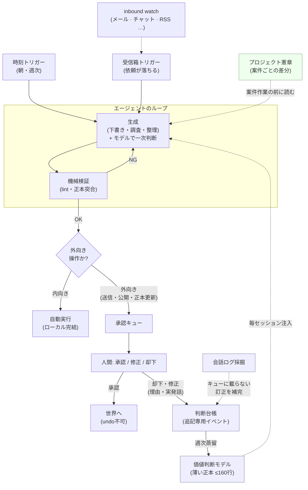
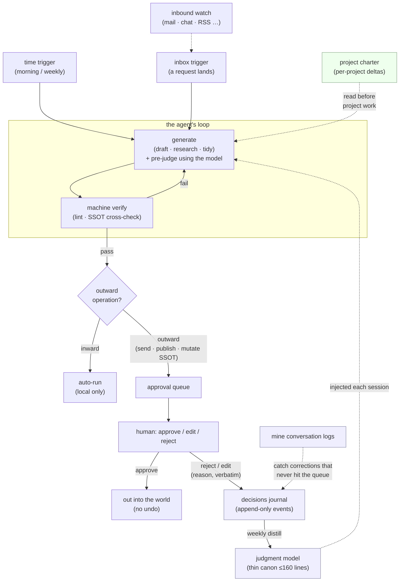

# 設計解説 — 実装の手引き

記事の要約ではなく、**このキットで実際にループを組むときの対応表と手順**。4部品＋マンデートが、どのファイル・どのスクリプトに落ちているかを示す。

*日本語が本文。全景図・4層の等式・依存校正は末尾に英語版がある（English versions of the loop diagram, the four-layer equation, and calibrated reliance are at the bottom of this document）。*

---

## 全体アーキテクチャ（ループ全景）



上半分が**承認ループ**（マンデート）: 生成 → 検証 → 内向き自動 / 外向きはキューへ → 人間が判断。下半分（網掛け）が**判断蒸留**（フィードバックの腕）: 人間の却下・修正理由が追記専用の**台帳**へ流れ、週次ジョブがそれを**価値判断モデル**へ**蒸留**し、そのモデルが注入されてエージェントが一次判断する——輪が閉じる。

---

## 4層の等式

| 層 | 問い | 業務での答え |
|---|---|---|
| コンテキスト | 何を知っているか | **SSOT**（`decisions` / `tasks` / `glossary` / `people`） |
| ハーネス | 何ができるか | CLI・スクリプト・ファイル操作 |
| ループ | いつ動き・どう検証するか | トリガー（時刻/受信箱）＋検証器 |
| **マンデート** | **どこまで任せるか・誰が責任を持つか** | **戻せる＝自動 / 戻せない＝承認キュー**（近似: 内向き / 外向き） |

3つ目までは「どう動かすか」、4つ目だけが「どこまで任せるか」——実験室を出て業務に置くと、効いてくるのは圧倒的に後者だ。業務の言葉に置き直すと4部品はぜんぶ昔からある概念——**トリガー＝段取り／検証器＝チェックリスト／停止規則＝締切／マンデート＝決裁。** コードはエージェントが書く。ループの設計図を引く仕事は、その仕事を一番知っている人間に留保される。どの部品がどのファイルに落ちるかは**次節の対応表**。

---

## 4部品＋マンデートの実装対応表

| 設計対象 | 業務の言葉 | このキットでの実装 |
|---|---|---|
| **トリガー** | 段取り | `scripts/morning_brief.sh`（時刻トリガー・cron/タスクスケジューラ）。受信箱トリガーは同型のスクリプトを watch で起動 |
| **トポロジー** | 分担 | 単独運用なら「メイン1本」。並列なら「受令専用のメイン＋実行するサブエージェント」。前作 [multi-agent-shogun](https://github.com/yohey-w/multi-agent-shogun) がこの層 |
| **検証器** | チェックリスト | `templates/verifiers.md`（機械層の lint／正本突合／日付検算／構造整合／未確認の断定と否定の射程＋成果物タイプ別 DoD） |
| **停止規則** | 締切 | 監査は最大2周（`verifiers.md`）／**夜間は回さない**／締切レーダーは `tasks.md` から生成 |
| **マンデート** | 決裁 | **戻せるものは自動、戻せないものは `approval_queue.md`**。実務上の近似が「内向き＝自動／外向き＝承認」で、分類は下表 |

---

## 依存校正 — キュー全体の底にある原則

そもそもなぜ外向き操作をゲートするのか。理由は一つの静かな失敗モードにある: **AI が出したという事実は、正しさの証拠ではない。** 流暢さや断定的な口調は証明ではない。承認キューは、このキットが採用する——設計の外部監査を経てたどり着いた——より深い原則の、運用上の形にすぎない:

> **短い看板。** AI が出したという事実は、正しさの証拠ではない。答えとして使う前に、用途に見合う検証を通す。

正式版は*どれだけ*検証するかまで定める:

> LLM の出力を、流暢さや断定調だけを根拠に正解として扱わない。各出力について、誤った場合の損失・可逆性・検出可能性・検証費用に応じて必要な確認水準を定め、独立資料・決定論的テスト・実験・別系統の評価・または人間の専門判断で検証する。低リスクで可逆な用途なら標本監査や事後監視で足りることもあるが、高リスクまたは不可逆な用途では実行*前*の独立検証を要求する。目的は AI を常に疑うことではなく、正しい出力を採用し誤った出力を拒む*適切な*依存を設計することだ。

次節の分類が、まさにこの理由でそこに落ちている。内向き操作は可逆で損失が小さいから、事後に標本監査すれば足りる。外向き操作はしばしば不可逆で損失が大きいから、撃つ*前*に独立検証をかける。承認キューは、業務で最も効く一軸——その操作が取り消せるか否か——に依存校正を適用したものだ。

**だから「内向き/外向き」は近似であって、軸そのものではない。** 実運用で当たるのは決まって2箇所——**可逆な外向き**（履歴が残って取り消せる push など。一件ずつ承認に回しても安全は増えず、承認者がボトルネックになるだけ）と、**不可逆な内向き**（ローカルで完結していても戻し口の無いデータ操作）。近似が便利な場面ではそのまま使い、この2箇所では本来の軸——**戻せるか**——で判定し直す（→ 次節の分類表・[`../templates/judgment_model.md`](../templates/judgment_model.md) P1）。

---

## 内向き / 外向きの分類（マンデートの中身）

マンデート設計の実体は、この一枚の分類だ。迷ったら外向き扱い（安全側）。

| | 内向き（自動実行してよい） | 外向き（承認キュー必須） |
|---|---|---|
| 生成 | 下書き・要約・調査・分類・整理 | — |
| ファイル | ローカルの一時ファイル・ブリーフ生成 | **正本（decisions/tasks/glossary/people）の書き換え** |
| 通信 | 自分への通知（ntfy 等の self-ping） | **送信**（メール・チャット返信）・**公開**（記事・共有ドキュメント） |
| その他 | 読み取り全般 | デプロイ・外部 API の書き込み系 |

**⚠️ この表は近似であって、軸そのものではない。** 本来の軸は**可逆 / 不可逆**（→ `templates/judgment_model.md` P1）。近似が外すのは決まって2箇所で、そこは本来の軸で判定し直す:

- **可逆な外向き** → 自動でよい。たとえば履歴が残って取り消せる push。これを一件ずつ承認に回すと、承認者がボトルネックになるだけで安全は増えない。ただし **push 先が本番へ自動デプロイされるなら承認**（push は戻せてもデプロイ済みの副作用は戻らない）。同じ理由で、履歴を壊す操作（強制上書き・タグ/ブランチの削除・履歴の書き換え・公開リリースの作成）は承認側に残す。
- **不可逆な内向き** → 承認を残す。ローカルで完結していても、本番データの削除・戻し口のないマイグレーションは表の「内向き」の顔をして素通りする。
- **承認不要にした操作でも、押した事実は報告する。** 承認と可視性は別物で、後者は落とさない。

一行に畳むとこうなる: **調査と下書きは自由に走らせ、実在の人・実在の金・記録の正本に触れる最後の1手にだけ人のゲートを置く。**

**なぜ「送信の失敗」を特別扱いするか。** コードの失敗はマージ前なら内部事故で済む。業務の出力は違う——送ったチャットは取り消せない。生成が完璧でも「それを今・その相手に・エージェントの一存で送ってよいか」は**別の問い**だ。検証器と停止規則をどれだけ磨いてもこの問いは解けないので、4つ目の設計対象として分離する。

**正本の書き換えも外向き。** 議事録から `decisions.md`/`tasks.md` への反映は、エージェントの一存でやらせない。差分を承認キューに積み、人間が承認した瞬間に正本が更新され、それが次のループの文脈になる。

---

## SSOT の設計（コンテキスト層の業務版）

エージェントのループは毎回、記憶ゼロで起き上がる。コードの世界ならリポジトリが文脈になるが、業務の文脈は人間の頭・チャットの奥地・会議メモに散らばる。それをディスク上の正本に固定する。最小セットは4ファイル（`templates/` にひな型）。

- `decisions.md` — 何が決まっているか（と、何が失効したか）
- `tasks.md` — 誰が・何を・いつまでに（と、どこから来たか）
- `glossary.md` — 用語を何と呼ぶか
- `people.md` — 登場人物と役割

**原則1: 出典と正本を分ける。** 会議メモ・文字起こし・チャットは「出典」。正本には抽出した結論だけを1箇所書き、出典へはリンクで辿る。同じ事実の違うバージョンを増殖させない。

**原則2: 決定は消さない。置換する。** `decisions.md` は追記専用。決定が変わったら古い行に `⚠️ 置換先:`、新しい行に `✅ 置換元:` を付けて両方残す。冒頭に「現在有効な決定」インデックスを置く。これは意思決定の**イベントソーシング**——時系列がイベントログ、インデックスがマテリアライズドビュー。「今なにが有効か」はインデックス、「なぜこうなったか」は同じ topic を遡る。

**grep 可能性が生命線。** 正本の主な読者は人間ではなくエージェントで、正規表現で引く。検証器の「正本突合」を機械化できるのは、正本が機械に引ける固定書式だから。ID 形式・topic 名・マーカー（✅/⚠️）を崩さないこと。

---

## エンドツーエンドの例: 会議 → 正本更新

いちばん頻度が高くて効くループ。

1. **文字起こしが落ちる（トリガー）。** 所定フォルダに文字起こしが置かれたら watch でループが起きる。
2. **構造化議事録に変換する（内向き・自動）。** 全文ではなく固定フォーマット（決定事項／ネクストアクション／未決の論点）へ絞る。規律3つ:
   - 文字起こしの固有名詞を信用しない → `people.md`/`glossary.md` と突合、未合致は `[要確認]`。
   - 決定とタスクには必ず出典（誰のどの発言か）。辿れないものは書かない。
   - 正本の書き換えは外向き扱い（次のステップ）。
3. **正本への差分を承認キューに積む（外向き・要承認）。** `decisions.md` へのこの追記・`tasks.md` へのこの3行、という差分を作り `approval_queue.md` へ。人間が承認した瞬間に正本が更新され、次のループの文脈になる。会議後に人間がやるのは承認だけ。

---

## 却下の蒸留ループ（このキットの差別化点）

承認キューは「事故を止める門」だが、それだけではもったいない。**却下・修正の理由を、次のループの資産に変える。**

```
外向き成果物 → 承認キュー → 人間が却下/修正（理由つき）
                                   │
              decisions.md に「却下パターン」として1件追記
                                   │
        週次で読み返し、同じ穴が2回開いたら検証器を1本足す
                                   │
      verifiers.md（機械層 or DoD）／エージェントへの指示を更新
                                   │
                以後、同じ穴は機械層で死ぬ（人間は同じ指摘を三度しない）
```

- **入力**: `approval_queue.md` の却下/修正理由。
- **蓄積**: `decisions.md`（追記専用の判断台帳。却下も一種の決定として残す）。
- **蒸留**: 週次トリガー（`morning_brief.sh` と同型のスクリプトを曜日固定で）で台帳を読み、**検証器の増補案**を承認キューに積む（検証器の更新も正本更新＝外向きなので人間が承認）。
- **出力**: `verifiers.md` に検証器が1本増える／指示が1行直る。

この「人間の判断ログ → 定期蒸留 → 検証器・指示の更新」という輪が、完成品のエージェント製品（他人が凍結したトリガー・検証器・停止規則・マンデート）には無い部分だ。日々の仕事が「作業」から「ループの改善」に変わる。

> 実装メモ: 蒸留は**提案までを自動、採用は承認キュー経由**にするのが安全。検証器を自動で書き換えると、検証器自体が偽陽性/偽陰性を静かに獲得しうる（検証器を検証する人がいなくなる）。

---

## プロジェクト文脈層 — 人格は1本、差分は憲章へ

案件（顧客・プロジェクト）が2つ以上になると、必ずこの問いが来る: **価値判断モデルは案件ごとに分割すべきか？** このキットの答えは否——**分けるのは原則そのものではなく「適用の層」**だ。

理由は蒸留ループの力学にある。訂正はこのループで最も枯れない学習信号（→「却下の蒸留ループ」）だが、判断モデルを案件ごとに割ると、その信号が案件の数だけ細い別々の流れに分散する。どの流れも薄すぎて蒸留が回らなくなる。同じ理屈で、原則の本文を憲章へコピーするのも禁止——同じ命題が2箇所にあると、訂正が片方にしか届かず、もう片方が静かに腐る（`decisions.md` の「決定は消さない、置換する」と同じイベントソーシングの規律）。

そこで3層に分ける:

| 層 | 実体 | 役割 | 分割方針 |
|---|---|---|---|
| **人格層** | `judgment/judgment_model.md` | 判断原則そのもの | **分割しない**——全案件で1本。訂正シグナルを分散させないため |
| **プロジェクト層** | `projects/<案件>/charter.md` | この案件では原則がどう適用されるかの**差分** | 案件ごとに1本・≤60行 |
| **案件イベント層** | 台帳の topic（`decisions_journal.md`） | 個別の裁定イベント | topic で grep |

憲章に書くのは5項目だけ（相手の型・委任境界・価格方針・文体レジスタ・原則の適用条件と例外）。**進捗・状況は憲章に書かない**——それは `system_map.md` のプロジェクトカードの仕事だ。憲章＝判断の差分、地図＝状態。進捗管理のための新しいツールは作らない: 「いま何の状況で次の一手は何か」は地図のカード4行（状況／次の一手＝こちら側／待ち＝相手のボール／期限）で持ち、朝のブリーフが吸い上げる。

なおワークフロー指向のエージェント基盤には、プロジェクトを第一級で分割するものが多い。それはワークフローが中核だからだ。このキットの中核は**承認者の判断モデル**なので、人格を割らず適用層だけを割るのが正しい分割線になる。

---

## ディレクトリ配置の5不変則 — clone に住む

このキットは「キット」と「インスタンス」をディレクトリで分離しない。**利用者は clone の中でそのまま実走する。** 個人データの安全は「別ディレクトリ」ではなく **allowlist 方式の `.gitignore`** が保証する: ルートの全エントリを ignore し、キット出荷物（`README` / `docs/` / `scripts/` / `templates/` 等）だけを un-ignore する。あなたが作る実データは**構造上 commit 不能**で、`git pull` はデータに触れずキットだけを更新する。これで「キットをコピーして持ち出し、本家から乖離していく」古典的な失敗（copy-drift）が消える。テンプレートは `templates/` に置いたまま（`config.env.example` と同じ「追跡される example 層」）で、`setup.sh` のコピーが example→live の変換になる。

配置を駆動する不変則は5つ:

1. **カード＝フォルダ＝憲章（1:1:1）。** `system_map.md` のカード1枚 ↔ `projects/<案件>/` 1つ ↔ その中の `charter.md` 1本。1:1:1 だから乖離（カードだけある・憲章だけある）を機械 lint できる。
2. **状態と履歴の分離。** `ssot/` は現在の真実（上書き更新）、`judgment/` の台帳は追記専用の過去。両者を混ぜない。
3. **人格は単数。** `judgment/` は案件で割らない。案件差分は各案件フォルダの `charter.md` にだけ置く（前節）。
4. **最も熱いファイルは最短パスに。** 毎セッション最初に読む `system_map.md` は `projects/` の下ではなくインスタンス直下に置く。
5. **アーカイブはフォルダ移動1回。** 案件の引退は `mv projects/<案件> projects/_archive/` で完了。憲章も判断の来歴ごと一緒に移る（削除しない）。

マシン固有のスクリプト・秘密情報は `local/`（git 追跡外）へ。私的な自動化の置き場はここ。

---

## 停止規則の実装

- **監査の周回上限**: 指摘ゼロで報告、指摘ありで1回だけ直してもう1周、計2周まで。収束しなければ人間へ（承認キューの「迷い」欄）。
- **夜間停止**: 自律実行の成果物は人間が読む速度を超える。読まれない在庫を積まないため、生成トリガーは日中のみ。
- **締切**: `tasks.md` の期日列が停止規則の外枠。締切レーダーは朝のブリーフが毎日出す。

---

## English

The three sections below are the English text of the loop diagram, the four-layer equation, and calibrated reliance — the same material as the Japanese sections of the same names above. The rest of this document is Japanese only.

### Architecture (the whole loop)



The top half is the **approval loop** (mandate): generate → verify → inward auto / outward to the queue → a human decides. The bottom half (shaded) is **judgment distillation** (the feedback arm): the human's reject/edit reasons flow into an append-only **journal**, a weekly job **distills** them into the **judgment model**, and that model is injected back so the agent pre-judges — closing the loop.

### The four-layer equation

| Layer | The question | The answer at work |
|---|---|---|
| Context | What does it know? | **SSOT** (`decisions` / `tasks` / `glossary` / `people`) |
| Harness | What can it do? | CLIs, scripts, file ops |
| Loop | When does it act, how is it checked? | triggers (time / inbox) + verifiers |
| **Mandate** | **How far is it trusted; who is accountable?** | **reversible = auto / irreversible = approval queue** (proxy: inward / outward) |

The first three are "how to make it run"; only the fourth is "how far to trust it" — and out of the lab, into real work, the fourth is what actually bites. Put in workplace words, the parts are all old ideas: **trigger = the setup, verifier = the checklist, stop rule = the deadline, mandate = sign-off authority.** The agent writes the code; drawing the loop's blueprint stays with the person who knows the work best. Which file each part lands in: the implementation table near the top of this document.

### Calibrated reliance — the principle under the whole queue

Why gate outward operations at all? Because of one quiet failure mode: **the fact that an AI produced something is not evidence that it's correct.** Fluency and a confident tone are not proof. The approval queue is only the operational form of a deeper rule this kit adopts (arrived at through outside audit of the design):

> **Short form.** The fact that an AI produced it is not evidence that it's right. Before you use an output as an answer, put it through verification proportional to its use.

The full form spells out *how much* verification:

> Don't treat an LLM's output as correct on the strength of fluency or a decisive tone alone. For each output, set the level of checking by the loss if it's wrong, its reversibility, how detectable an error would be, and the cost of checking — then verify with independent sources, deterministic tests, experiments, a separate line of evaluation, or expert human judgment. For low-risk, reversible uses, a sample audit or after-the-fact monitoring can be enough; for high-risk or irreversible uses, require independent verification *before* execution. The goal is not to distrust AI at all times, but to design the *right* reliance — adopt the correct outputs, reject the wrong ones.

This is exactly why the inward / outward split falls where it does: inward operations are reversible and low-loss, so a sample audit after the fact is enough; outward operations are often irreversible and high-loss, so they get independent verification *before* they fire. The queue is calibrated reliance applied to the one axis that bites hardest at work — whether an action can be undone.

**Which means inward/outward is a proxy, not the axis itself.** In practice it misfires in exactly two places: **reversible-outward** (a push that leaves history and can be reverted — gating each one buys no safety and makes you the bottleneck) and **irreversible-inward** (a local-only data operation with no way back). Use the proxy where it's convenient; in those two places, re-decide on the real axis — **can this be undone?** (The classification table is in the Japanese section above; see also P1 of [`../templates/judgment_model.md`](../templates/judgment_model.md).)

**What stays on the approval side even though it looks reversible:** force-overwrite (anything but a lease-checked force), deleting a tag or a branch, rewriting history, cutting a public release — and a push whose target auto-deploys to production, because the push is revertible but the side effects of a deploy that already happened are not. And an operation you stopped gating is still an operation you report: approval and visibility are separate, and only the first one was dropped.
