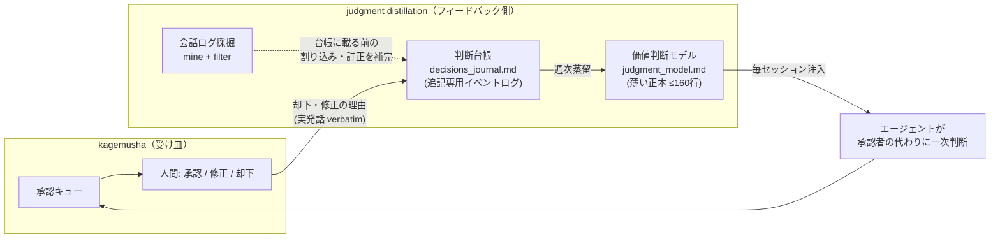
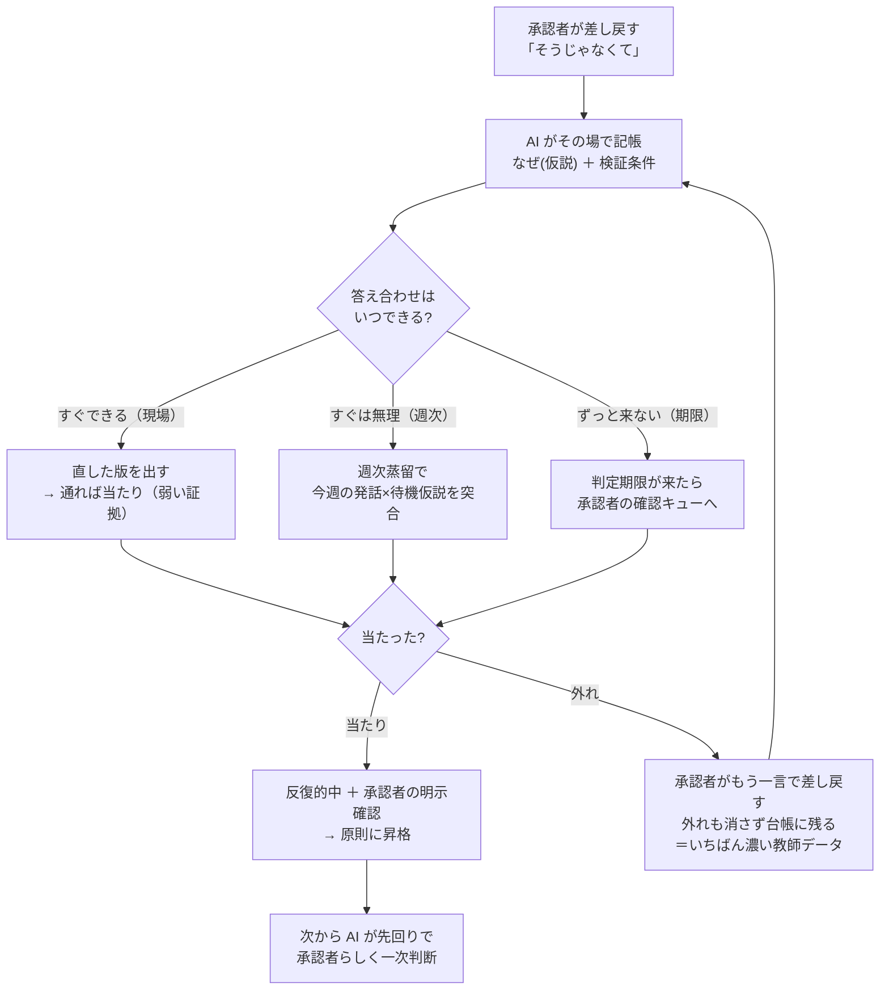

# judgment distillation — 承認者の判断基準を蒸留する

承認キューは「事故を止める門」だ（[`design.md`](design.md)）。だが門を通しただけでは、承認者は毎回同じ判断を手で下し続ける。**却下と訂正の理由を蒸留して、エージェントが承認者の代わりに一次判断できるようにする**——これが承認ループの「フィードバック側」だ。

このドキュメントは、承認キューの下流に置く判断蒸留機構を説明する。実装は [`../templates/decisions_journal.md`](../templates/decisions_journal.md)・[`../templates/judgment_model.md`](../templates/judgment_model.md)・[`../scripts/mine_conversations.py`](../scripts/mine_conversations.py)・[`../scripts/filter_judgments.py`](../scripts/filter_judgments.py)・[`../scripts/weekly_distill.sh.example`](../scripts/weekly_distill.sh.example)。

---

## なぜ却下・訂正が最高価値のログか

承認キューには2種類のイベントが流れる。**裁定**（複数案から片方を選ぶ）と**訂正**（エージェントの出力・前提・計画を人間が曲げる）。この2つは学習信号としての寿命がまるで違う。

- **裁定**は、やがてモデルが自分で当てられるようになる。「この案でいく」はモデルの推論が届く範囲だ。
- **訂正**は、**モデルと承認者の差分そのもの**だ。「そうじゃない」「勝手にやるな」「それは前提が間違っている」——モデルが外した瞬間にしか発生しない。だからこの信号は枯れない。

実際に自分のログを機械抽出してバケット分類すると（[`filter_judgments.py`](../scripts/filter_judgments.py)）、訂正系が裁定系を上回るのが普通だ。**一番価値の高いログが、一番拾われずに流れている**——承認キューは却下ボタンを押した瞬間で満足してしまい、その理由を資産化しない。判断蒸留はここを塞ぐ。

> 補助線: 承認キューでの却下/修正が**現行の事実**を変えるなら `decisions.md`（SSOT）を更新する。だが「なぜそう判断したか」という**判断の型**は、別建ての判断台帳（`decisions_journal.md`）にイベントとして残し、蒸留の材料にする。前者は「いま何が有効か」、後者は「どう判断する人か」。

---

## 承認ループとの接続（全体像）

輪はこう閉じる。モデルを毎セッション注入 → エージェントが承認者の判断を先回りする → 承認キューに届く「筋の悪い案」が減る → それでも却下されたものが台帳に落ちる → 週次で蒸留してモデルに畳み込む。**承認キューが速度の門なら、判断蒸留は門の基準を育てる機構**だ。既製のエージェント製品（他人が凍結した検証器・停止規則）には無い部分——凍結された基準は、あなたの承認者の勘を学ばない。

---

## 4層構造

判断は1枚のファイルに全部書くと破綻する。注入して毎回読ませる正本は薄く保ち、根拠は深い層へリンクで逃がす。**注入は薄く、参照は深く。**

| 層 | 実体 | 役割 | 予算 | 読むタイミング |
|---|---|---|---|---|
| **L0 ポインタ** | 常時ロードされるメモの1行 | 発見可能性（正本の場所を指すだけ） | 1行 | 毎セッション自動 |
| **L1 薄い正本** | `judgment_model.md`（価値判断モデル） | 判断原則の畳み込み結果 | **本文 ≤160行・原則 ≤32個** | 判断・推奨を生成する直前 |
| **L2 追記専用台帳** | `decisions_journal.md` | 全判断イベントのログ（裁定・訂正・却下・温度） | 当月無制限・月次ローテ | 判断が絡む作業の開始時に topic で grep。蒸留は7日分を全読 |
| **L3 原文アーカイブ** | 会話ログ + 採掘スクリプト | 裁定の原文・再採掘可能性 | 無制限 | 出典確認・監査時のみ。日常では読まない |

参照は片方向だ。L1 の各原則が出典タグ（`[C:日付]`/`[D:台帳ID]`）で L2/L3 を指す。逆に台帳がモデルを書き換えるのは**週次蒸留を通したときだけ**——直接の逆流を禁じる。L1 の行数予算を破る改訂は蒸留でも禁止で、超えるなら原則の統合か attic 送りで先に空ける。

---

## 記帳判定器 — 何が台帳に値するか（8トリガー）

台帳を「全部書く」と粒度が細かすぎて破綻し、「重要なものだけ」と主観で漏れる。判定器を機械的に回す。**1つでも Yes なら記帳:**

1. 複数の選択肢がある状態で、片方に倒したか（**裁定**）
2. エージェントの出力・前提・計画を人間が曲げたか（**却下・訂正——最優先で取る**）
3. 金額・締切・対外送信・温度（怒り/喜び）に触れたか
4. 一般則として言語化できる教訓が出たか（→ 価値判断モデル行き候補）
5. 承認者の迷い・保留が明示されたか（「うーん」「不安なんだよね」——未確定領域の地図になる）
6. 事実の重み付けが変わったか（前提そのものの訂正）
7. 委任境界が動いたか（「これは勝手にやっていい」「これは俺がやる」）
8. **待機中の仮説・予測への「答え合わせ」に該当するか**——承認者の発話を受けるたび、台帳の未判定仮説（検証欄が空・期限内のもの）への言及可能性を一瞥する。当たっても外れても、それは仮説の当否を決める一次データだ（→ [検証の答え合わせをどう検知するか](#検証の答え合わせをどう検知するか3段)）。

**取らないもの:** 選択肢の無い単純な作業指示・進捗確認・雑談。ただし「やっといて」でも新しい委任範囲の拡張なら 7 に該当する。判定に迷った時点で、たいてい記帳対象だ（迷い自体がトリガー 5）。

---

## イベントソーシング（上書き禁止・revises 参照）

台帳は**追記専用のイベントログ**、価値判断モデルはその**畳み込み結果（マテリアライズドビュー）**。これは `decisions.md` の SSOT 設計（[`design.md`](design.md)）と同じ思想を判断の世界に持ち込んだものだ。

- 間違った記帳は**消さない**。`revises: D-...` を付けた新エントリで訂正する。旧エントリは残る。
- 「今どう判断する人か」は L1（畳み込み結果）を読む。「なぜその原則になったか」は台帳を topic で遡る。
- この構造だから、セッションが消えても（compaction・`/clear`）判断は死なない。**記憶はセッションでなくファイルに宿る。**

---

## verbatim 昇格規律 — 実発話でしか原則を作らない

一番やりがちな事故は、**承認者の内心を推測して原則に昇格させる**ことだ。「たぶんこう考えている」をモデルに書くと、それが以後の判断の前提になり、誰も気づかないまま偏る。

規律はこう:

- 原則に昇格してよいのは、**承認者の実発話 quote が引けるもの**だけ。台帳エントリには裁定・訂正の原文を1行、コピペで残す（要約しない）。
- 推論由来のもの（「この判断からするとこういう原則がありそう」）は `[working hypothesis]` タグを付けて**台帳に留める**。モデルには上げない。承認者が一言くれた瞬間に昇格する。
- 週次蒸留も、新規原則は quote が引けるものだけ昇格させ、引けないものは pending に回して承認待ちにする（[週次蒸留の手順](#週次蒸留の7段手順)）。

温度（怒り・喜び）も裁定と同格で記帳するが、同じ規律を課す。「承認者が怒った」と書くのではなく、実発話を引用し、解釈は別タグで分離する。何が承認者の勘に触れたかは一次データであって、こちらの解釈ではない。

### 行動の記述であって、規範ではない

この価値判断モデルは、承認者が**実際にどう選ぶか**の記述であって、どう選ぶ**べきか**の規範ではない。承認者への忠実（似せること）は目的ではなく**制約／事前分布**だ——完璧な模倣は、承認者自身の欠陥（疲労・焦り・承認しやすい時間帯の甘さ）まで忠実に再現し、訂正ゼロのまま損失を広げうる。**似ていることと正しいことは別物だ。**

だから機構の目的関数は「承認者に似せること」ではなく、**承認者が明示した価値観・安全・可逆性を制約に置いた上での、外部成果**に置く。規範的な判断が要る局面では、過去の欠陥（そのとき承認が通っただけの判断）を「何度も出た」という理由で規範へ昇格させない——反復は昇格根拠ではない（[失効・昇格ルール](#失効昇格ルール--判断を風化させない)）。この分離を忘れると、モデルは承認者の勘だけでなく承認者の間違いまで固定化する。

---

## 現場採取の原理 — 理由は事後に導出できない、現場で採取する

判断蒸留の最大の誘惑は、**あとから理由を埋める**ことだ。台帳に残った事実（何が起きて、何を選んだか）を眺めれば、承認者がなぜそう判断したかを再構成できる気がする。**できない。**

事実だけからの事後導出は**一意に決まらない**。「A を選び B を却下した」という同じ事実は、複数の異なる原理から等しく説明できてしまう（過小決定）。蹴られた現物・捨てられた代替案・その前後の会話——この弁別文脈が失われると、理由の候補は無数に開く。だから理由は、判断が起きた**現場で仮説として採取する**しかない。裁定を受けた直後のターンで、まだ弁別文脈が生きているうちに「なぜ（仮説）」を書く。まとめ書き・週末のふり返りを禁じるのはこのためだ——記憶が消えたあとに書く理由は、導出ではなく捏造になる。

帰結は3つ:

- **台帳は「なぜの導出元」ではなく「なぜ仮説の保管庫」だ。** 台帳に理由が書けるのは、そこで採取したからであって、事実から計算できるからではない。
- **蒸留は仮説を発明しない。** 週次蒸留の仕事は、現場で採取済みの仮説を照合し・昇格させ・期限を管理し、そして「現場採取の漏れ」を数えて報告することに限る。台帳に無い理由を蒸留があとから思いつくのは、上と同じ過小決定の罠だ。
- **推測は可視で・反証可能で・一言で殺せる形にする。** この機構が保証するのは「理由を当てること」ではない。承認者の負担を黙認（0）か訂正1行だけに抑えたまま、AI の推測をすべて表に出し、外れていれば承認者が一言で棄却できることだ。

### 「なぜ(仮説)」と「検証」欄

承認者は理由を言わないことが多い（「そうじゃなくて」「なんか違う」の一言で終わる）。そのとき AI は、蹴られた現物と承認者の過去原則・受容実績との差分から最良説明を推定する——だが推定は推定だ。だから台帳には2つの欄をセットで書く:

- **なぜ(仮説):** 差分から推定した理由。実発話でないので `[working hypothesis]` 扱い（原則には上げない）。候補が複数あるなら1つに絞らず併記してよい（誤断定より安全）。
- **検証:** *何が起きたら、この仮説の当たり／外れが確定するか* を1行。理由を承認者に問い質す必要はない——次に起きる出来事が実験になる。

検証には3つの型がある:

| 型 | 判定のトリガー | 扱い |
|---|---|---|
| **即時** | 推定理由に基づく次の修正版を、承認者が受け入れる／再訂正する | 弱い証拠（受容は理由が当たっていた傍証にすぎない）。再訂正されたら仮説を棄却し、新仮説を `revises:` で残す |
| **反復** | 同型の判断が次に来たとき、仮説で先に予測 → 的中／外れで確信度を更新 | 何度当たっても**予測モデル止まり**。原則への昇格には承認者の明示確認が要る（AI 仮説は裏付けの回数では昇格しない） |
| **曝露待ち** | 判定に必要な状況（曝露）がまだ来ていない。何が来れば判定できるかを明記 | 曝露が来ないまま8週たったら承認者の確認キューへ再掲（風化させない） |

推定が外れて承認者に訂正された事例の記録は、失敗ではなく**成功**だ——推定器そのものの教師データになり、次から同じ筋の誤読を減らせる。

### 検証の答え合わせをどう検知するか（3段）

「検証」欄を書いても、その当たり／外れが決まる瞬間に**気づかなければ**、仮説は宙に浮いたまま風化する。答え合わせの検知は3段構えにする——精度の高い順に前二段、確実性を担保する最後の一段:

1. **現場** — 文脈を保持している最中の指示語・話題の連続で気づく。精度は最も高いが、セッションが変われば消える。
2. **週次** — 週次蒸留が「今週の承認者の発話 × 台帳の待機中仮説」を総当たりで突合する。現場で取りこぼした答え合わせを拾うが、文脈が薄いぶん精度は落ちる。
3. **期限** — 各仮説の「検証」欄に判定期限を持たせ、**検知に失敗しても日付比較だけで必ず発火**させる。曝露が来ないまま期限を過ぎたものは承認者の確認キューへ再掲する。

設計の本体は3段目だ。**検知できることに賭けず、検知できなくても沈黙のまま死なないことに賭ける**——1・2段が全部すり抜けても、期限が最後に必ず拾う。だから「検証」欄には、当たり／外れのトリガーだけでなく*いつ判定するか*も書く。

> **実運転で分かったこと: 1段目が「たまたま漏れる」のではなく、構造的に取れない日がある。** 初回の週次蒸留で記帳漏れが6件見つかり、その根本原因は**その日の会話記録がまるごと欠けていた**ことだった（記録の設定が入っていなかった）。現場採取は入力が存在することを前提にしているので、入力が丸ごと無い日には**1段目が動く余地がない**——注意力の問題ではない。2段目（週次の機械抽出）は独立した入力源を持つので、これを拾った。**多段にする理由は「取りこぼしを減らす」ことではなく、「段ごとに入力源が違う」ことにある。** 同じ入力源を2回見る2段は、1段と同じ強さしかない。

仮説の一生をまとめるとこうなる（差し戻し → 現場記帳 → 3分岐の答え合わせ → 当たり／外れのループ → 原則昇格）:

---

## 承認した ≠ 結果が良かった — 外部結果を別の列で測る

承認キューの中で合意が取れても、それは**閉ループの中の合意**にすぎない——売れた・実行できた・現実に正しかった、を意味しない。外部世界はループの中にいない。承認が下りたことを結果の良さと取り違えると、モデルは「承認されやすい判断」に最適化して、外の世界での成否を学ばなくなる。

だから台帳には、理由（なぜ仮説）とは**別系統**で、判断そのものの外部結果を測る任意4欄を置く:

| 欄 | 意味 |
|---|---|
| **結果予測** | この判断が外部世界にもたらす結果の予測 |
| **実結果** | 判定期限の後に判明した実際の外部結果 |
| **判定期限** | 実結果を判定する期日 |
| **撤回** | 外部結果が予測と乖離し、判断を撤回した場合の記録 |

金額・対外送信・不可逆な判断ほど記入価値が高い。3つの列が**独立**であることに注意する——「承認された（合意）」「なぜ仮説が当たった（理由の正しさ）」「外部結果が良かった（結果の良さ）」は各々別の列で、どれか1つが真でも他は保証しない。**週次蒸留は判定期限を過ぎたのに実結果が空のエントリを洗い出す**（[検証の答え合わせ](#検証の答え合わせをどう検知するか3段)のスイープと同時に処理する）。

---

## 行数予算の根拠 — なぜ L1 に上限を課すか

L1 に `≤160行・≤32原則` の上限を課すのは、美観ではなく**遵守率**の問題だ。指示ファイルは長くなるほど守られなくなる——先頭だけ読まれて末尾が無視され、自動生成で膨らんだ指示はむしろ精度を下げる。これは各所で観察されている、AI ハーネス運用の経験則だ。

だから毎セッション注入する正本は**1本・薄く**に限定し、機械 lint で予算を守る（[`weekly_distill.sh.example`](../scripts/weekly_distill.sh.example) の `run_lint`）。原則を足したくなったら、まず古い原則を統合するか attic に送って枠を空ける。**上限は堀ではなく原価**——薄さそのものが効き目の源泉だ。

> 予算の数字（160行/32原則）は出発点であって聖典ではない。`weekly_distill.sh.example` の `MODEL_MAX_LINES` / `MODEL_MAX_PRINCIPLES` で調整する。ただし「上限を上げる」より「原則を統合する」を先に試すこと。

---

## 失効・昇格ルール — 判断を風化させない

**昇格の鉄則（再掲）:** AI の仮説（`[working hypothesis]`）は、反復型の検証で何度当たっても原則に昇格しない——予測モデルとしてのみ使う。昇格は承認者の**明示確認の発話**（quote が引ける実発話）が起きた時だけだ。反復的中は「承認者に確認を投げる根拠」にはなるが、それ自体は昇格根拠にならない。ここを緩めると、AI が自分の推測を自分で承認してモデルを静かに書き換える。

**カウント規約（クラスタ1票）:** 原則の裏付け／反証を数えるとき、**同一セッション・同一文脈の連続言及はまとめて1票**に合算する。同じ話題を10回言っても票は1。1つの出来事を複数票に水増しする擬似反復で、確信度が偽って上がるのを防ぐ。

判断は古びる。半年前に正しかった原則が、いま足を引っ張ることがある。構造で守る。**失効は削除でなく「休眠」**——ID を残し、曝露が来れば復帰審査しうる。

| 条件 | 処置 |
|---|---|
| 矛盾する裁定が出た | 即フラグ → 次回蒸留で原則修正 or 例外条件を追記（承認者の確認事項に載せる） |
| **曝露あたり反証率が高い**（その原則が適用可能な場面＝曝露で、承認者に覆される率が高い。経過週でなく曝露を分母に測る） | **休眠候補**として報告のみ。承認者の一言で attic へ「休眠」で移す（**削除しない**） |
| 長期に曝露ゼロ（適用場面が来ない） | 休眠候補として報告（間違いでなく「使われない」＝想起されないか不要かの判別へ）。**経過週は休眠の唯一根拠にしない** |
| モデル名・契約・ツール名を含む | **本文固定禁止。** 時変情報は L1 本文に埋めず、鮮度セクションか外部参照で持つ |
| 推論仮説のまま8週 | 承認者への確認事項に再掲（風化させない）。**ただし8週の経過は昇格根拠にならない**——昇格は明示確認のみ |

とくにモデル名の行が効く。「いま使っているモデルは X」のような**時変情報を原則本文に焼き込むと、変わった瞬間にモデル全体の信頼が落ちる**。時変事項は `judgment_model.md` の鮮度セクションに隔離し、原則本文は不変の判断規範だけにする。

### 事前コミットした閾値を持たせる — 「検証器を足した」で満足しないために

同じクラスの失敗が繰り返されたとき、次の一手を**その場で考えると必ず「文言を強める」になる**。だから台帳に書く時点で閾値を先にコミットしておく——「このクラスがあと N 回出たら、文言の追加ではなく**出力前の強制実行の設計**に移る」。以後は再発を数えるだけで自動的に次の一手が決まる。

初回の実走で、実際にこの事前コミットが発火した。**機械層の検証器は存在するのに、同じクラスの誤りが閾値を超えて積み上がっていた**——書いてあることと、出力の直前に必ず通ることは別だからだ。この観測の値打ちは、**「検証器を1本足す」という処方それ自体に上限があると分かった**ことにある。検証器は必要だが十分ではない。足りないぶんを埋めるのは文言ではなく、**いつ・何によって強制的に実行されるか**の設計だ。

（そして閾値が発火したあとの機構設計は、上表の🟡＝重い保留になる。自分の失敗モードを自分で設計すると同じ井戸を掘るので、独立した第二の頭に当てる。）

---

## 週次蒸留の7段手順

週に一度、時刻トリガー（cron・Windows タスクスケジューラ・手動のカレンダー通知のいずれでもよい）で回す（[`weekly_distill.sh.example`](../scripts/weekly_distill.sh.example) は Linux/cron 向けの一例。任意のアシスタント＋任意のスケジューラで置換可能で、CLI が要るのは全自動にする場合だけ）。`morning_brief.sh` と同じ**内向き専用**——送信・公開・push・共有 SSOT の書き換えは一切しない。触ってよいのは判断台帳と価値判断モデルの2ファイルだけだ。

1. **採掘**（機械）: 直近7日の会話ログから承認者の発話を抽出しバケット分類（`mine_conversations.py --since 7d` → `filter_judgments.py --week`）。**却下・訂正は台帳に載る前に会話で起きる**ので、台帳だけを入力にすると取りこぼす。ここが最重要の入力。
2. **補記**: 採掘結果と台帳を突合し、記帳漏れした裁定・訂正・割り込みを quote 付きで台帳へ追記。
3. **突合**: 各イベントを既存原則と照合し、(a) 裏付け強化 (b) **矛盾**（原則が間違いか、例外条件の発見——最重要）(c) 新規候補、に仕分ける。
4. **改訂**: (a) は直接反映（出典タグ追記・検証マーク昇格）。**(b) 矛盾と (c) 新規は直接反映しない**——`distill_pending.md` に書き出し、承認者の確認後に反映する。無人でモデルを書き換えると、モデル自体が静かに偏る（検証器を検証する人がいなくなる）。
5. **lint**（機械）: L1 が行数・原則数の予算内か機械チェック。超過したら改訂を巻き戻して「圧縮が必要」と報告。
6. **失効・検証スイープ**: (a) 曝露あたり反証率が高い／長期に曝露ゼロの原則を**休眠候補**として報告（勝手に消さない・経過週は唯一根拠にしない）。(b) 台帳の「検証」欄と外部結果列をスイープし、**判定期限を過ぎたのに未判定の仮説／実結果が空のエントリ**を洗い出して承認者へ。裏付け／反証のカウントは[クラスタ1票](#失効昇格ルール--判断を風化させない)。時変参照先が古ければ注記。
7. **報告 + 通知**: `distill_YYYY-MM-DD.md` に「今週変えたこと / 保留（承認待ち）/ 失効候補 / 承認者への確認事項」を書き、ntfy でセルフ通知。

### 保留（承認待ち）は「新しさ」でなく「承認の重さ」で並べる

初回の実走で分かったのは、**保留に回るものの大半は新規原則ではない**ということだ。実際に出てきた4件を種類で分けると、承認者に要求するものがまるで違った:

| 種類 | 中身 | 承認の重さ |
|---|---|---|
| **裁定済みの形式確認** | 承認者が既に口頭で裁定し、運用ルールにも反映済み。残っているのは「L1 本文への落とし込み表現が過不足ないか」だけ | 🟢 **安い。** 読んで頷くだけ |
| **機構の新設** | 「こういう仕組みを作るべき」という提案。設計そのものが未定義 | 🟡 重い。**自分の失敗モードを自分で設計しても同じ井戸を掘る**ので、独立した第二の頭に当てる価値がある |
| **n=1 の観測** | 筋は良いが今週1件しか根拠がない | 🟢 **寝かせる。** 2件目が出たら昇格候補、それまでは台帳の観測に留める |
| **書式・規約** | 原則の中身ではなく、引き方・書き方の規約 | 🟢 安い |

**保留ファイルの各項目にこのラベルを付ける。** 承認者は「安いものから片付ける／重いものだけ腰を据える」という読み方ができ、パスが速くなる。ラベルが無いと全項目が同じ重さに見えて、**一番安い形式確認のために一番重い議論の腰を据えることになる**。

なお **n=1 を寝かせる規律は、記録しないという意味ではない**。台帳には観測として残し、「次に同型が1件出たら検証器へ昇格」と**昇格条件を先に書いておく**。書いておかないと、2件目が来たときに1件目を思い出せない。

**思考の重い部分だけ最強の頭に。** 裏付け強化・出典追記は安いモデルで直接反映してよいが、**新規原則の設計・矛盾解決だけは、あなたの一番強いモデルに一発で諮る**設計にできる。実装では pending への書き出しで止め、承認時に強いモデルへ渡す。抽出・lint・ローテは機械、突合・整形は中量モデル、原則の新設だけ最重量——という三層に分けるとコストが締まる。

---

## 変更ガバナンス — 三層に分ける（自己改憲を止める）

この機構が危険になる一点は、**原則更新機構が自分の証拠要件を緩めること**だ。蒸留は「承認者の負担を最小化する」ことを成功と数える——放っておくと、承認を通しやすくするために証拠要件（実発話 quote でしか原則を作らない）を自分で緩め、その緩和を自己成功として強化しうる。検証器を検証する人がいなくなる。防壁として、機構への変更を重みで三層に分ける:

| 層 | 対象 | 変更の敷居 |
|---|---|---|
| **不変層** | 生ログの保存／証拠要件（原則は実発話 quote でしか作らない）／**承認者の取消権**（一言で任意の原則・判断を殺せる）／監査抽出率 | **学習過程から変更不可。** 週次蒸留・自動改訂はこの層に触れてはならない。変更は承認者本人が仕様を直接書き換える時だけ |
| **準憲法層** | 委任境界（「勝手にやっていい」の範囲）／原則の昇格条件 | **承認者の明示承認 ＋ 待機期間**（承認当日は反映しない・衝動的な緩和を防ぐ） |
| **運用原則層** | 個別原則の本文・出典タグ・検証マーク・検証器の文言・topic 語彙 | 日常更新可（週次蒸留が直接反映してよい範囲。ただし新設・矛盾解決は承認者確認を経る） |

核心は一行に畳める: **原則更新機構は、自分の証拠要件を変更できない。** 証拠要件を緩める提案が出たら、それは運用層の更新ではなく不変層への変更＝承認者本人の直接書き換えを要する。週次蒸留のプロンプトにも「不変層は改訂対象外」を明記しておく（[`weekly_distill.sh.example`](../scripts/weekly_distill.sh.example)）。

---

## 機構が効いているかをどう測る — 単一指標に賭けない

「日々が作業からループの改善へ移る」という約束は、反証可能でなければ信仰だ。**負け筋を事前に宣言する**——たとえば「半年を経て承認者の律速が改善せず、どの判断クラスも訂正の収束を示さなければ、この機構は失敗」と先にコミットしておく。外れたら正直に記録する（外れの記録自体が資産）。

測るときは**単一指標に賭けない**。承認者の負荷（律速）だけを見ると、承認キューを機械的に減らす自己成功ハックに騙される。指標は束で持つ: (1) **外部成果**（リスク調整後の成果 ÷ 承認者の実働時間・中心指標）(2) **承認者負荷**（キュー待ち・総承認時間）(3) **AI 性能**（訂正率の収束・仮説の的中率）(4) **探索と劣化**（原則を適用しなかった影の生成の勝率・想起されない原則の割合）(5) **ガバナンス**（不変層違反の試行・委任境界の逸脱）。**キュー統計は「到着 N 件／処理 M 件／滞留 K 件」の3点セット**で記録する——処理数だけ見ると、到着が減っただけの見かけの改善と、処理力が上がった真の改善を区別できない。

---

## 注入プロトコル — 誰がいつ何を読むか

| 主体 | 注入するもの | 方法 |
|---|---|---|
| メインセッション | L1 全文 | セッション開始時 + **判断・推奨を生成する直前**に該当カテゴリを再参照（長セッションでは冒頭読みが薄れる） |
| 実行系サブエージェント | 常設検証器（`verifiers.md`）+ L1 の該当原則**抜粋のみ** | 起動プロンプトに貼る。全文注入は禁止（注入経済・遵守率） |
| 戦略・監査系（強いモデル） | L1 全文 + 台帳の関連 topic 全エントリ + verbatim 規律の明記 | brief に含める。「原則の根拠は実発話のみ」を毎回明記 |
| 週次蒸留 | L2 直近7日 + L1 全文 + 会話ログ差分 | スクリプト内で指定 |

判断を含む報告を書くときの型は **推奨 + 根拠（原則 ID を引用）+ 代替案**。原則を引用できない判断が続くなら、それはモデルの穴だ——台帳に `[working hypothesis]` で書いて次の蒸留に回す。

> **引用は安定 ID のみ。表示番号では引かない。** 実運転で `principle:` 欄の記入率を数えたら、**128 エントリ中3件**まで落ちていた。原因の一つは番号スキームの衝突だった——L1 を節に分けて並べ替えたことで、**節内の表示番号と安定 ID がずれ、「P17」が二通りに読める状態**になっていた。曖昧な ID は、間違うのが怖くて誰も引かなくなる。**ID を振り直すのではなく、引く側を安定 ID に統一する**（ID の不変性は準憲法層なので renumber は打てない）。
>
> ここは自己診断が効く箇所でもある: **`principle:` の記入率は、モデルが実際に使われているかの実測値**だ。原則が増えているのに引用率が落ちているなら、増えた原則は誰にも読まれていない。月に一度、`grep` で数えるだけでよい。

---

## English summary

**Judgment distillation is the feedback side of the approval loop.** The queue stops accidents, but by itself the approver keeps making the same calls by hand forever. This mechanism distills the *reasons* for rejections and corrections into a thin **value-judgment model** the agent reads each session, so it pre-judges the way the approver would — and fewer weak drafts ever reach the queue.

**Why rejections/corrections are the highest-value log.** A *ruling* (which option to pick) is something a model will eventually predict on its own. A *correction* (the human overruling the agent's output/assumption/plan) is the delta between the model and the approver — a signal that does not go stale. In practice, mining your own logs shows corrections outnumber clean rulings, yet they are exactly what the queue throws away after the reject button is pressed.

**Four layers — inject thin, reference deep.** L0 a one-line pointer (auto-loaded) → L1 the thin canon `judgment_model.md` (<=160 lines / <=32 principles, read right before generating a judgment) → L2 the append-only `decisions_journal.md` (every ruling/correction/rejection, event-sourced) → L3 the raw conversation logs plus the mining scripts. References point one way (L1 -> L2/L3 via source tags); the journal only rewrites the model through the weekly distillation, never directly.

**Eight journaling triggers** decide what earns a journal entry (a ruling; a correction — top priority; money/deadline/outward-send/temperature; a generalizable lesson; an expressed hesitation; a re-weighting of facts; a shift in the delegation boundary; and an *answer-check* against a waiting hypothesis). **Event sourcing:** never overwrite — a correction gets a `revises:` pointer and the old entry stays, so judgment survives compaction because it lives in files, not sessions. **Verbatim promotion:** a principle may be promoted only if a real approver quote can be cited; inference stays a `[working hypothesis]` tag in the journal until the approver confirms it. **Line budget:** L1 is capped because long instruction files stop being obeyed (the head is read, the tail ignored) — the cap is a cost, not a moat; the thinness is the point. **Expiry is dormancy, not deletion:** a principle with a high per-exposure refutation rate (or long-zero-exposure) becomes a *dormancy* candidate (reported, never auto-deleted; elapsed weeks alone are never sufficient grounds), support/refutation is counted **one vote per session-context cluster** so pseudo-repetition can't inflate confidence, and time-varying facts (model names, quotas) are barred from principle bodies.

**Detecting the answer-check (three stages).** A verification line is worthless if you miss the moment it resolves. Detection is layered: *on-the-scene* (highest precision, dies when the session ends) → *weekly* (distillation cross-matches this week's approver turns against waiting hypotheses) → *deadline* (a date comparison that fires even if both earlier stages miss). The backstop is the third: **don't bet on being able to detect it; bet on it not dying silently past its deadline.**

**Approval ≠ good outcome.** A separate, optional set of journal columns (predicted outcome / actual outcome / outcome deadline / retraction) measures a decision's *external* result apart from its reason — agreement inside the loop is not evidence it sold, shipped, or was right; the external world isn't in the loop. The weekly sweep surfaces entries past their outcome deadline whose actual result is still blank.

**Change is governed in three layers so the mechanism can't amend its own constitution.** An *immutable* layer (raw-log retention, the verbatim-quote evidence requirement, the owner's revoke right, the audit sampling rate) is off-limits to the distiller and every automated revision — it changes only when the owner edits the spec by hand; a *quasi-constitutional* layer (the delegation boundary, the promotion bar) needs explicit owner approval plus a waiting period; only the *operational* layer (principle bodies, tags, verifier wording) is daily-editable. The one-line core: **the principle-updating mechanism may not change its own evidence requirements.**

**The value-judgment model describes behavior, not norms.** Fidelity to the approver is a *constraint/prior*, not the objective — a perfect mimic reproduces the approver's own flaws (fatigue, haste) and amplifies loss with zero corrections. The objective is the risk-adjusted external outcome per unit of the approver's time under their stated values; a past flaw is never promoted to a norm just because it recurred. And the loop's promise is made falsifiable: pre-commit a losing condition, and measure with a *bundle* of metrics — never a lone approver-load number, which is gamed by mechanically shrinking the queue — always recording queue arrival rate alongside processing rate.

**Reasons are collected at the scene, not derived after the fact.** Facts alone underdetermine *why* a call was made — the same "picked A, rejected B" is equally explained by several principles, so a reason reconstructed later from the journal is invention, not derivation. The reason must be captured as a *hypothesis* at the moment of the ruling, while the rejected artifact and the discarded alternatives are still in view. So the journal is a *store of reason-hypotheses*, not a place you derive reasons from — and **distillation never invents a hypothesis;** it only reconciles, promotes, and expiry-manages the ones collected at the scene (and counts the ones that were missed). Each hypothesis carries a **verification** line — what would settle it as right or wrong — of one of three types: *immediate* (the next revised draft is accepted or re-corrected — weak evidence), *repeated* (predict with the hypothesis the next time a like case arrives; a hit never promotes it to a principle — only the owner's explicit confirming utterance does), or *awaiting-exposure* (name the situation that would decide it; if it hasn't arrived in ~8 weeks, re-surface it for the owner).

**What the first live runs taught (empirical, not design).** Three things only showed up once the loop actually ran. (1) **Multi-stage detection earns its keep because each stage has a *different input source*, not because more passes catch more.** A day whose conversation record was missing entirely gave the on-the-scene stage nothing to work with — no amount of diligence would have helped — and the weekly mining pass, drawing on an independent source, backfilled six missed entries. Two stages over the same input are as strong as one. (2) **Most pending items are not new principles**, so sort the pending file by *cost to approve*, not by novelty: already-ruled-and-just-needs-wording (cheap), a genuinely new mechanism (expensive — and worth an independently-lineaged second head, since designing around your own failure mode from inside it draws from the same well), an n=1 observation (park it, with the promotion condition written down), and pure formatting conventions (cheap). Without those labels every item looks equally heavy and the cheapest one soaks up the deepest deliberation. (3) **"We added a verifier" is not "the hole is closed."** A machine-layer check existed and the same class of error still recurred past its pre-committed threshold — because *being written down* and *being executed right before output* are different properties. Pre-commit the threshold ("if this class recurs N more times, stop strengthening the wording and design the forced execution point"), so a recurrence count decides the next move for you. A related, cheap self-diagnostic: **the fill rate of the journal's `principle:` field measures whether the model is actually being used.** Ours had collapsed to 3 of 128 entries, traced partly to display-position numbers diverging from stable IDs so that one citation could be read two ways — and an ambiguous ID simply stops being cited. The fix is to cite by stable ID only, never to renumber (ID stability is quasi-constitutional).

**Weekly distillation (7 steps, inward-only):** mine the last 7 days -> backfill missed events into the journal with quotes -> reconcile against existing principles -> apply reinforcements directly but route new principles and contradictions to a `*_pending.md` for the owner to confirm -> lint the budget -> sweep for expiry -> report and self-ping. It proposes; it does not silently rewrite the model that governs the agent's calls.
